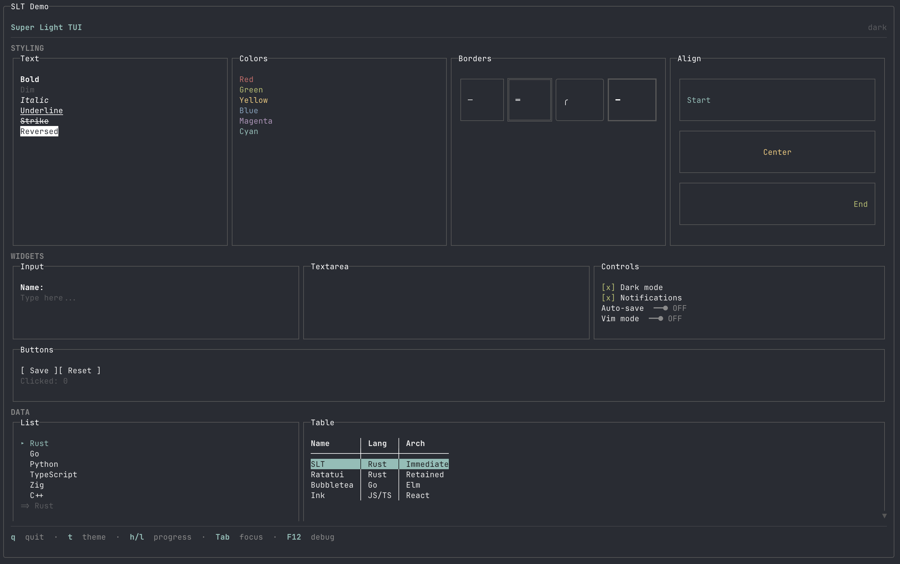
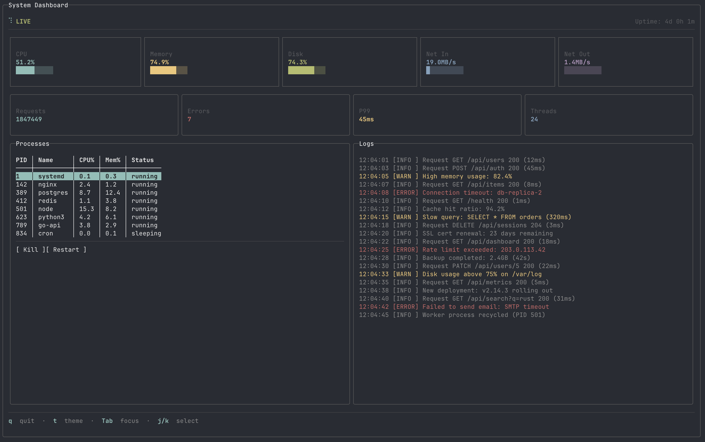
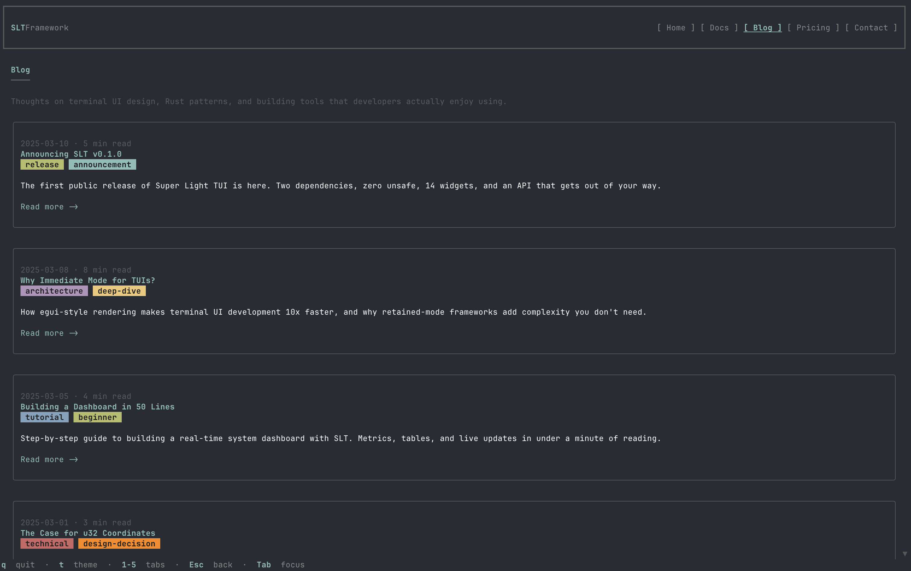
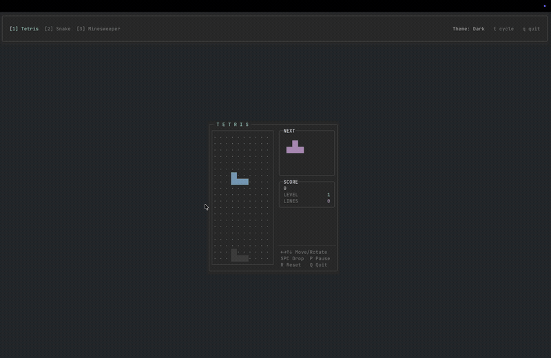

<div align="center">

# SuperLightTUI

**Superfast** to write. **Superlight** to run.

[![Crate Badge]][Crate]
[![Docs Badge]][Docs]
[![License Badge]][License]

[Crate] · [Docs] · [Examples] · [Contributing]

</div>

## Showcase

<table>
  <tr>
    <td align="center"><br/><b>Widget Demo</b><br/><sub><code>cargo run --example demo</code></sub></td>
    <td align="center"><br/><b>Dashboard</b><br/><sub><code>cargo run --example demo_dashboard</code></sub></td>
  </tr>
  <tr>
    <td align="center"><br/><b>Website Layout</b><br/><sub><code>cargo run --example demo_website</code></sub></td>
    <td align="center"><br/><b>Games</b><br/><sub><code>cargo run --example demo_game</code></sub></td>
  </tr>
  <tr>
    <td align="center" colspan="2"><br/><b>DOOM Fire Effect</b><br/><sub><code>cargo run --release --example demo_fire</code></sub></td>
  </tr>
</table>

## Getting Started

```sh
cargo add superlighttui
```

```rust
fn main() -> std::io::Result<()> {
    slt::run(|ui: &mut slt::Context| {
        ui.text("hello, world");
    })
}
```

5 lines. No `App` struct. No `Model`/`Update`/`View`. No event loop. Ctrl+C just works.

## A Real App

```rust
use slt::{Border, Color, Context, KeyCode};

fn main() -> std::io::Result<()> {
    let mut count: i32 = 0;

    slt::run(|ui: &mut Context| {
        if ui.key('q') { ui.quit(); }
        if ui.key('k') || ui.key_code(KeyCode::Up) { count += 1; }
        if ui.key('j') || ui.key_code(KeyCode::Down) { count -= 1; }

        ui.bordered(Border::Rounded).title("Counter").pad(1).gap(1).col(|ui| {
            ui.text("Counter").bold().fg(Color::Cyan);
            ui.row(|ui| {
                ui.text("Count:");
                let c = if count >= 0 { Color::Green } else { Color::Red };
                ui.text(format!("{count}")).bold().fg(c);
            });
            ui.text("k +1 / j -1 / q quit").dim();
        });
    })
}
```

State lives in your closure. Layout is `row()` and `col()`. Styling chains. That's it.

## Why SLT

**Your closure IS the app** — No framework state. No message passing. No trait implementations. You write a function, SLT calls it every frame.

**Everything auto-wires** — Focus cycles with Tab. Scroll works with mouse wheel. Containers report clicks and hovers. Widgets consume their own events.

**Layout like CSS, syntax like Tailwind** — Flexbox with `row()`, `col()`, `grow()`, `gap()`, `spacer()`. Tailwind shorthand: `.p()`, `.px()`, `.py()`, `.m()`, `.mx()`, `.my()`, `.w()`, `.h()`, `.min_w()`, `.max_w()`.

```rust
ui.container()
    .border(Border::Rounded)
    .p(2).mx(1).grow(1).max_w(60)
    .col(|ui| {
        ui.row(|ui| {
            ui.text("left");
            ui.spacer();
            ui.text("right");
        });
    });
```

**Two core dependencies** — `crossterm` for terminal I/O. `unicode-width` for character measurement. Optional: `tokio` for async, `serde` for serialization.

## Widgets

30+ built-in widgets, zero boilerplate:

```rust
ui.text_input(&mut name);                    // single-line input
ui.textarea(&mut notes, 5);                  // multi-line editor
if ui.button("Submit") { /* clicked */ }     // button returns bool
ui.checkbox("Dark mode", &mut dark);         // toggle checkbox
ui.toggle("Notifications", &mut on);         // on/off switch
ui.tabs(&mut tabs);                          // tab navigation
ui.list(&mut items);                         // selectable list
ui.select(&mut sel);                         // dropdown select
ui.radio(&mut radio);                        // radio button group
ui.multi_select(&mut multi);                 // multi-select checkboxes
ui.tree(&mut tree);                          // expandable tree view
ui.virtual_list(&mut list, 20, |ui, i| {}); // virtualized list
ui.table(&mut data);                         // data table
ui.spinner(&spin);                           // loading animation
ui.progress(0.75);                           // progress bar
ui.scrollable(&mut scroll).col(|ui| { });    // scroll container
ui.toast(&mut toasts);                       // notifications
ui.separator();                              // horizontal line
ui.help(&[("q", "quit"), ("Tab", "focus")]); // key hints
ui.link("Docs", "https://docs.rs/slt");      // clickable hyperlink (OSC 8)
ui.modal(|ui| { ui.text("overlay"); });      // modal with dim backdrop
ui.overlay(|ui| { ui.text("floating"); });   // overlay without backdrop
ui.command_palette(&mut palette);            // searchable command palette
ui.markdown("# Hello **world**");            // markdown rendering
ui.form_field(&mut field);                   // labeled input with validation
ui.chart(|c| { c.line(&data); c.grid(true); }, 50, 16); // line/scatter/bar chart
ui.histogram(&values, 40, 12);               // auto-binned histogram
ui.bar_chart(&data, 24);                     // horizontal bars
ui.sparkline(&values, 16);                   // trend line ▁▂▃▅▇
ui.canvas(40, 10, |cv| { cv.circle(20, 20, 15); }); // braille canvas
ui.grid(3, |ui| { /* 3-column grid */ });    // grid layout
```

Every widget handles its own keyboard events, focus state, and mouse interaction.

### Custom Widgets

Implement the `Widget` trait to build your own:

```rust
use slt::{Context, Widget, Color, Style};

struct Rating { value: u8, max: u8 }

impl Widget for Rating {
    type Response = bool;

    fn ui(&mut self, ui: &mut Context) -> bool {
        let focused = ui.register_focusable();
        let mut changed = false;

        if focused {
            if ui.key('+') && self.value < self.max { self.value += 1; changed = true; }
            if ui.key('-') && self.value > 0 { self.value -= 1; changed = true; }
        }

        let stars: String = (0..self.max)
            .map(|i| if i < self.value { '★' } else { '☆' })
            .collect();
        let color = if focused { Color::Yellow } else { Color::White };
        ui.styled(stars, Style::new().fg(color));
        changed
    }
}

// Usage: ui.widget(&mut rating);
```

Focus, events, theming, layout — all accessible through `Context`. One trait, one method.

## Features

<details>
<summary><b>Layout</b></summary>

| Feature | API |
|---------|-----|
| Vertical stack | `ui.col(\|ui\| { })` |
| Horizontal stack | `ui.row(\|ui\| { })` |
| Grid layout | `ui.grid(3, \|ui\| { })` |
| Gap between children | `.gap(1)` |
| Flex grow | `.grow(1)` |
| Push to end | `ui.spacer()` |
| Alignment | `.align(Align::Center)` |
| Padding | `.p(1)`, `.px(2)`, `.py(1)` |
| Margin | `.m(1)`, `.mx(2)`, `.my(1)` |
| Fixed size | `.w(20)`, `.h(10)` |
| Constraints | `.min_w(10)`, `.max_w(60)` |
| Percentage sizing | `.w_pct(50)`, `.h_pct(80)` |
| Justify | `.space_between()`, `.space_around()`, `.space_evenly()` |
| Text wrapping | `ui.text_wrap("long text...")` |
| Borders with titles | `.border(Border::Rounded).title("Panel")` |
| Per-side borders | `.border_top(false)`, `.border_sides(BorderSides::horizontal())` |

</details>

<details>
<summary><b>Styling</b></summary>

```rust
ui.text("styled").bold().italic().underline().fg(Color::Cyan).bg(Color::Black);
```

16 named colors · 256-color palette · 24-bit RGB · 6 modifiers · 4 border styles

</details>

<details>
<summary><b>Theming</b></summary>

```rust
slt::run_with(RunConfig { theme: Theme::light(), ..Default::default() }, |ui| {
    ui.set_theme(Theme::dark()); // switch at runtime
});
```

Dark and light presets. Custom themes with 13 color slots. All widgets inherit automatically.

</details>

<details>
<summary><b>Rendering</b></summary>

- **Double-buffer diff** — only changed cells hit the terminal
- **Synchronized output** — DECSET 2026 prevents tearing on supported terminals
- **u32 coordinates** — no overflow on large terminals
- **Clipping** — content outside container bounds is hidden
- **Viewport culling** — off-screen widgets are skipped entirely
- **FPS cap** — `RunConfig { max_fps: Some(60), .. }` for CPU control
- **Non-TTY safety** — graceful exit when stdout is not a terminal
- **Resize handling** — automatic reflow on terminal resize

</details>

<details>
<summary><b>Animation</b></summary>

```rust
let mut tween = Tween::new(0.0, 100.0, 60).easing(ease_out_bounce);
let value = tween.value(ui.tick());

let mut spring = Spring::new(0.0, 180.0, 12.0);
spring.set_target(100.0);

let mut kf = Keyframes::new(120)
    .stop(0.0, 0.0).stop(0.5, 100.0).stop(1.0, 50.0)
    .loop_mode(LoopMode::PingPong);

let mut seq = Sequence::new()
    .then(0.0, 50.0, 30, ease_out_quad)
    .then(50.0, 100.0, 30, ease_in_out_cubic);

let mut stagger = Stagger::new(0.0, 1.0, 40).delay(8);
let val = stagger.value(tick, item_index);
```

Tween with 9 easing functions. Spring physics. Keyframe timelines with loop modes. Sequence chains. Stagger for list animations.

</details>

<details>
<summary><b>Inline Mode</b></summary>

```rust
slt::run_inline(3, |ui| {
    ui.text("Renders below your prompt.");
    ui.text("No alternate screen.").dim();
});
```

Render a fixed-height UI below the cursor without taking over the terminal.

</details>

<details>
<summary><b>Async</b></summary>

```rust
let tx = slt::run_async(|ui, messages: &mut Vec<String>| {
    for msg in messages.drain(..) { ui.text(msg); }
})?;
tx.send("Hello from background!".into()).await?;
```

Optional tokio integration. Enable with `cargo add superlighttui --features async`.

</details>

<details>
<summary><b>Error Boundary</b></summary>

```rust
ui.error_boundary(|ui| {
    ui.text("If this panics, the app keeps running.");
});

ui.error_boundary_with(
    |ui| { /* risky code */ },
    |ui, msg| { ui.text(format!("Recovered: {msg}")); },
);
```

Catch widget panics without crashing the app. Partial commands are rolled back and a fallback is rendered.

</details>

<details>
<summary><b>Input Validation</b></summary>

```rust
let mut email = TextInputState::with_placeholder("you@example.com");
ui.text_input(&mut email);
email.validate(|v| {
    if v.contains('@') { Ok(()) } else { Err("Invalid email".into()) }
});
```

Call `.validate()` after `text_input()` to show inline error messages. Works with `form_field()` for grouped form validation.

</details>

<details>
<summary><b>Modal & Overlay</b></summary>

```rust
ui.modal(|ui| {
    ui.bordered(Border::Rounded).pad(2).col(|ui| {
        ui.text("Confirm?").bold();
        if ui.button("OK") { show = false; }
    });
});

ui.overlay(|ui| {
    ui.row(|ui| {
        ui.spacer();
        ui.text("Status: Online").fg(Color::Green);
    });
});
```

`modal()` dims the background and renders content on top. `overlay()` renders floating content without dimming. Both support full layout and interaction.

</details>

<details>
<summary><b>Hyperlinks</b></summary>

```rust
ui.link("Documentation", "https://docs.rs/superlighttui");
```

Renders clickable OSC 8 hyperlinks. Ctrl/Cmd+click opens in browser on supporting terminals (iTerm2, WezTerm, Ghostty, Windows Terminal).

</details>

<details>
<summary><b>Snapshot Testing</b></summary>

```rust
use slt::TestBackend;

let mut backend = TestBackend::new(40, 10);
backend.run(|ui| {
    ui.bordered(Border::Rounded).pad(1).col(|ui| {
        ui.text("Hello");
    });
});
insta::assert_snapshot!(backend.to_string_trimmed());
```

Use with [insta](https://crates.io/crates/insta) for snapshot-based UI regression tests.

</details>

<details>
<summary><b>Serde</b></summary>

```sh
cargo add superlighttui --features serde
```

Serialize/deserialize `Style`, `Color`, `Theme`, `Border`, `Padding`, `Margin`, `Constraints`, and `Modifiers`.

</details>

<details>
<summary><b>Testing</b></summary>

```rust
use slt::{TestBackend, EventBuilder, KeyCode};

let mut backend = TestBackend::new(80, 24);
let events = EventBuilder::new().key('q').key_code(KeyCode::Enter).build();
backend.run_with_events(events, |ui| {
    ui.text("test content");
});
assert!(backend.to_string().contains("test content"));
```

Headless rendering with `TestBackend` and event simulation with `EventBuilder` for automated testing.

</details>

<details>
<summary><b>Debug</b></summary>

Press **F12** in any SLT app to toggle the layout debugger overlay. Shows container bounds, nesting depth, and layout structure.

</details>

## Examples

| Example | Command | What it shows |
|---------|---------|---------------|
| hello | `cargo run --example hello` | Minimal setup |
| counter | `cargo run --example counter` | State + keyboard |
| demo | `cargo run --example demo` | All widgets |
| demo_dashboard | `cargo run --example demo_dashboard` | Live dashboard |
| demo_cli | `cargo run --example demo_cli` | CLI tool layout |
| demo_spreadsheet | `cargo run --example demo_spreadsheet` | Data grid |
| demo_website | `cargo run --example demo_website` | Website in terminal |
| demo_game | `cargo run --example demo_game` | Tetris + Snake + Minesweeper |
| demo_fire | `cargo run --release --example demo_fire` | DOOM fire effect (half-block) |
| inline | `cargo run --example inline` | Inline mode |
| anim | `cargo run --example anim` | Tween + Spring + Keyframes |
| demo_v050 | `cargo run --example demo_v050` | v0.5.0 features |
| demo_infoviz | `cargo run --example demo_infoviz` | Data visualization |
| async_demo | `cargo run --example async_demo --features async` | Background tasks |

## Architecture

```
Closure → Context collects Commands → build_tree() → flexbox layout → diff buffer → flush
```

Each frame: your closure runs, SLT collects what you described, computes flexbox layout, diffs against the previous frame, and flushes only the changed cells.

Pure Rust. No macros, no code generation, no build scripts.

## Contributing

See [CONTRIBUTING.md](CONTRIBUTING.md) for guidelines.

## License

[MIT](LICENSE)

<!-- Badge definitions -->
[Crate Badge]: https://img.shields.io/crates/v/superlighttui?style=flat-square&logo=rust&color=E05D44
[Docs Badge]: https://img.shields.io/docsrs/superlighttui?style=flat-square&logo=docs.rs
[License Badge]: https://img.shields.io/crates/l/superlighttui?style=flat-square&color=1370D3

<!-- Link definitions -->
[Crate]: https://crates.io/crates/superlighttui
[Docs]: https://docs.rs/superlighttui
[Examples]: https://github.com/subinium/SuperLightTUI/tree/main/examples
[Contributing]: https://github.com/subinium/SuperLightTUI/blob/main/CONTRIBUTING.md
[License]: ./LICENSE
