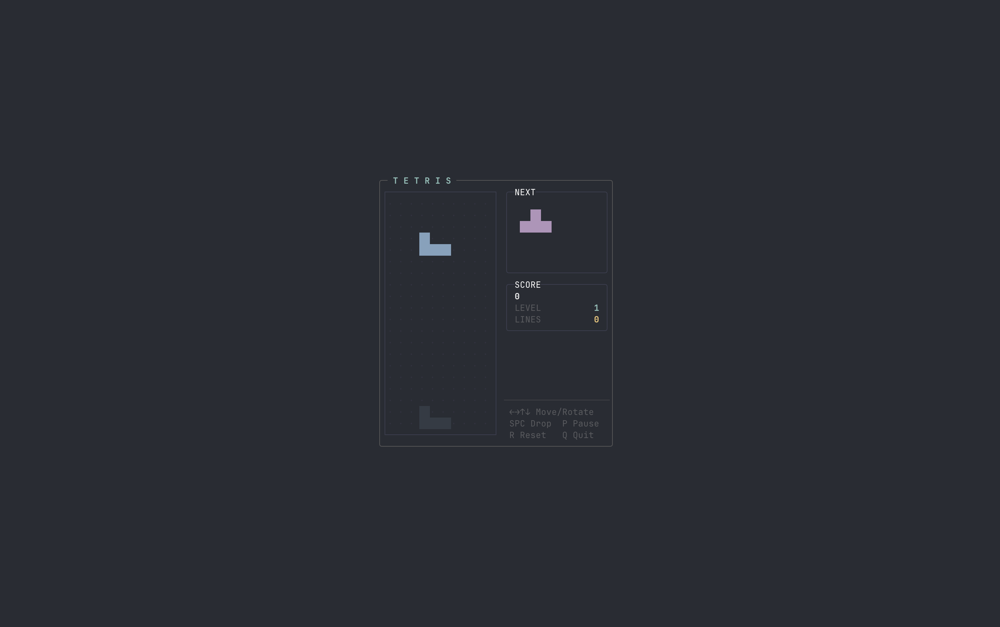

<div align="center">

# SuperLightTUI

**Build terminal UIs in Rust. Fast.**

Immediate-mode. Two dependencies. Zero `unsafe`. ~5k lines of code.

[![Crate Badge]][Crate]
[![Docs Badge]][Docs]
[![License Badge]][License]

[Crate] · [Docs] · [Examples] · [Contributing]

</div>

## Showcase

<table>
  <tr>
    <td align="center"><br/><b>Widget Demo</b><br/><sub><code>cargo run --example demo</code></sub></td>
    <td align="center"><br/><b>Dashboard</b><br/><sub><code>cargo run --example demo_dashboard</code></sub></td>
  </tr>
  <tr>
    <td align="center"><br/><b>Website Layout</b><br/><sub><code>cargo run --example demo_website</code></sub></td>
    <td align="center"><br/><b>Tetris</b><br/><sub><code>cargo run --example demo_tetris</code></sub></td>
  </tr>
</table>

## Getting Started

```sh
cargo add superlighttui
```

```rust
fn main() -> std::io::Result<()> {
    slt::run(|ui: &mut slt::Context| {
        ui.text("hello, world");
    })
}
```

5 lines. No `App` struct. No `Model`/`Update`/`View`. No event loop. Ctrl+C just works.

## A Real App

```rust
use slt::{Border, Color, Context, KeyCode};

fn main() -> std::io::Result<()> {
    let mut count: i32 = 0;

    slt::run(|ui: &mut Context| {
        if ui.key('q') { ui.quit(); }
        if ui.key('k') || ui.key_code(KeyCode::Up) { count += 1; }
        if ui.key('j') || ui.key_code(KeyCode::Down) { count -= 1; }

        ui.bordered(Border::Rounded).title("Counter").pad(1).gap(1).col(|ui| {
            ui.text("Counter").bold().fg(Color::Cyan);
            ui.row(|ui| {
                ui.text("Count:");
                let c = if count >= 0 { Color::Green } else { Color::Red };
                ui.text(format!("{count}")).bold().fg(c);
            });
            ui.text("k +1 / j -1 / q quit").dim();
        });
    })
}
```

State lives in your closure. Layout is `row()` and `col()`. Styling chains. That's it.

## Why SLT

**Your closure IS the app** — No framework state. No message passing. No trait implementations. You write a function, SLT calls it every frame.

**Everything auto-wires** — Focus cycles with Tab. Scroll works with mouse wheel. Containers report clicks and hovers. Widgets consume their own events.

**Layout like CSS, syntax like Tailwind** — Flexbox with `row()`, `col()`, `grow()`, `gap()`, `spacer()`. Tailwind shorthand: `.p()`, `.px()`, `.py()`, `.m()`, `.mx()`, `.my()`, `.w()`, `.h()`, `.min_w()`, `.max_w()`.

```rust
ui.container()
    .border(Border::Rounded)
    .p(2).mx(1).grow(1).max_w(60)
    .col(|ui| {
        ui.row(|ui| {
            ui.text("left");
            ui.spacer();
            ui.text("right");
        });
    });
```

**Two dependencies** — `crossterm` for terminal I/O. `unicode-width` for character measurement. That's the entire dependency tree.

## Widgets

14 built-in widgets, zero boilerplate:

```rust
ui.text_input(&mut name);                    // single-line input
ui.textarea(&mut notes, 5);                  // multi-line editor
if ui.button("Submit") { /* clicked */ }     // button returns bool
ui.checkbox("Dark mode", &mut dark);         // toggle checkbox
ui.toggle("Notifications", &mut on);         // on/off switch
ui.tabs(&mut tabs);                          // tab navigation
ui.list(&mut items);                         // selectable list
ui.table(&mut data);                         // data table
ui.spinner(&spin);                           // loading animation
ui.progress(0.75);                           // progress bar
ui.scrollable(&mut scroll).col(|ui| { });    // scroll container
ui.toast(&mut toasts);                       // notifications
ui.separator();                              // horizontal line
ui.help(&[("q", "quit"), ("Tab", "focus")]); // key hints
```

Every widget handles its own keyboard events, focus state, and mouse interaction.

### Custom Widgets

Implement the `Widget` trait to build your own:

```rust
use slt::{Context, Widget, Color, Style};

struct Rating { value: u8, max: u8 }

impl Widget for Rating {
    type Response = bool;

    fn ui(&mut self, ui: &mut Context) -> bool {
        let focused = ui.register_focusable();
        let mut changed = false;

        if focused {
            if ui.key('+') && self.value < self.max { self.value += 1; changed = true; }
            if ui.key('-') && self.value > 0 { self.value -= 1; changed = true; }
        }

        let stars: String = (0..self.max)
            .map(|i| if i < self.value { '★' } else { '☆' })
            .collect();
        let color = if focused { Color::Yellow } else { Color::White };
        ui.styled(stars, Style::new().fg(color));
        changed
    }
}

// Usage: ui.widget(&mut rating);
```

Focus, events, theming, layout — all accessible through `Context`. One trait, one method.

## Features

<details>
<summary><b>Layout</b></summary>

| Feature | API |
|---------|-----|
| Vertical stack | `ui.col(\|ui\| { })` |
| Horizontal stack | `ui.row(\|ui\| { })` |
| Gap between children | `.gap(1)` |
| Flex grow | `.grow(1)` |
| Push to end | `ui.spacer()` |
| Alignment | `.align(Align::Center)` |
| Padding | `.p(1)`, `.px(2)`, `.py(1)` |
| Margin | `.m(1)`, `.mx(2)`, `.my(1)` |
| Fixed size | `.w(20)`, `.h(10)` |
| Constraints | `.min_w(10)`, `.max_w(60)` |
| Text wrapping | `ui.text_wrap("long text...")` |
| Borders with titles | `.border(Border::Rounded).title("Panel")` |

</details>

<details>
<summary><b>Styling</b></summary>

```rust
ui.text("styled").bold().italic().underline().fg(Color::Cyan).bg(Color::Black);
```

16 named colors · 256-color palette · 24-bit RGB · 6 modifiers · 4 border styles

</details>

<details>
<summary><b>Theming</b></summary>

```rust
slt::run_with(RunConfig { theme: Theme::light(), ..Default::default() }, |ui| {
    ui.set_theme(Theme::dark()); // switch at runtime
});
```

Dark and light presets. Custom themes with 13 color slots. All widgets inherit automatically.

</details>

<details>
<summary><b>Rendering</b></summary>

- **Double-buffer diff** — only changed cells hit the terminal
- **u32 coordinates** — no overflow on large terminals
- **Clipping** — content outside container bounds is hidden
- **Resize handling** — automatic reflow on terminal resize

</details>

<details>
<summary><b>Animation</b></summary>

```rust
let mut tween = Tween::new(0.0, 100.0, 60).easing(ease_out_bounce);
let value = tween.value(ui.tick());

let mut spring = Spring::new(0.0, 180.0, 12.0);
spring.set_target(100.0);
```

Tween with 9 easing functions. Spring with configurable stiffness and damping.

</details>

<details>
<summary><b>Inline Mode</b></summary>

```rust
slt::run_inline(3, |ui| {
    ui.text("Renders below your prompt.");
    ui.text("No alternate screen.").dim();
});
```

Render a fixed-height UI below the cursor without taking over the terminal.

</details>

<details>
<summary><b>Async</b></summary>

```rust
let tx = slt::run_async(|ui, messages: &mut Vec<String>| {
    for msg in messages.drain(..) { ui.text(msg); }
})?;
tx.send("Hello from background!".into()).await?;
```

Optional tokio integration. Enable with `cargo add superlighttui --features async`.

</details>

<details>
<summary><b>Debug</b></summary>

Press **F12** in any SLT app to toggle the layout debugger overlay. Shows container bounds, nesting depth, and layout structure.

</details>

## Examples

| Example | Command | What it shows |
|---------|---------|---------------|
| hello | `cargo run --example hello` | Minimal setup |
| counter | `cargo run --example counter` | State + keyboard |
| demo | `cargo run --example demo` | All 14 widgets |
| demo_dashboard | `cargo run --example demo_dashboard` | Live dashboard |
| demo_cli | `cargo run --example demo_cli` | CLI tool layout |
| demo_spreadsheet | `cargo run --example demo_spreadsheet` | Data grid |
| demo_website | `cargo run --example demo_website` | Website in terminal |
| demo_tetris | `cargo run --example demo_tetris` | Playable Tetris |
| inline | `cargo run --example inline` | Inline mode |
| anim | `cargo run --example anim` | Tween + Spring |
| async_demo | `cargo run --example async_demo --features async` | Background tasks |

## Architecture

```
Closure → Context collects Commands → build_tree() → flexbox layout → diff buffer → flush
```

Each frame: your closure runs, SLT collects what you described, computes flexbox layout, diffs against the previous frame, and flushes only the changed cells.

~5,800 lines of Rust. 11 source files. No macros, no code generation, no build scripts.

## Contributing

See [CONTRIBUTING.md](CONTRIBUTING.md) for guidelines.

## License

[MIT](LICENSE)

<!-- Badge definitions -->
[Crate Badge]: https://img.shields.io/crates/v/superlighttui?style=flat-square&logo=rust&color=E05D44
[Docs Badge]: https://img.shields.io/docsrs/superlighttui?style=flat-square&logo=docs.rs
[License Badge]: https://img.shields.io/crates/l/superlighttui?style=flat-square&color=1370D3

<!-- Link definitions -->
[Crate]: https://crates.io/crates/superlighttui
[Docs]: https://docs.rs/superlighttui
[Examples]: https://github.com/subinium/SuperLightTUI/tree/main/examples
[Contributing]: https://github.com/subinium/SuperLightTUI/blob/main/CONTRIBUTING.md
[License]: ./LICENSE
