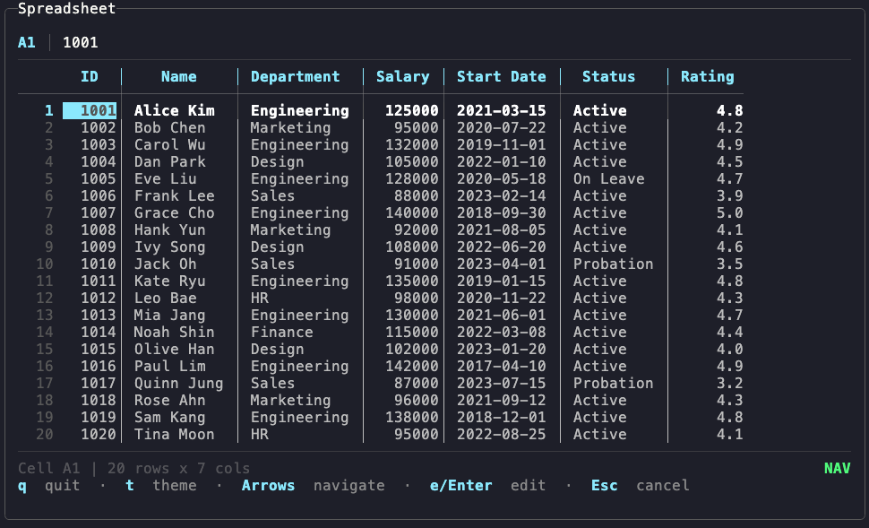
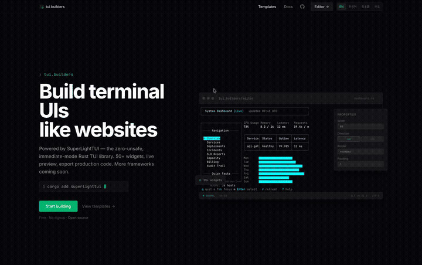

<div align="center">

# SuperLightTUI

**Rapidísimo de escribir. Ultraligero de ejecutar.**

[![Crate Badge]][Crate]
[![Docs Badge]][Docs]
[![CI Badge]][CI]
[![MSRV Badge]][Crate]
[![Downloads Badge]][Crate]
[![License Badge]][License]

[Crate] · [Docs] · [Examples] · [Contributing]

[English](../README.md) · [中文](README.zh-CN.md) · **Español** · [日本語](README.ja.md) · [한국어](README.ko.md)

</div>

## Galería

<table>
  <tr>
    <td align="center"><br/><b>Widget Demo</b><br/><sub><code>cargo run --example demo</code></sub></td>
    <td align="center"><br/><b>Dashboard</b><br/><sub><code>cargo run --example demo_dashboard</code></sub></td>
    <td align="center"><br/><b>Website Layout</b><br/><sub><code>cargo run --example demo_website</code></sub></td>
  </tr>
  <tr>
    <td align="center"><br/><b>Spreadsheet</b><br/><sub><code>cargo run --example demo_spreadsheet</code></sub></td>
    <td align="center"><br/><b>Games</b><br/><sub><code>cargo run --example demo_game</code></sub></td>
    <td align="center"><br/><b>DOOM Fire Effect</b><br/><sub><code>cargo run --release --example demo_fire</code></sub></td>
  </tr>
</table>

## Primeros pasos

```sh
cargo add superlighttui
```

```rust
fn main() -> std::io::Result<()> {
    slt::run(|ui: &mut slt::Context| {
        ui.text("hello, world");
    })
}
```

5 líneas. Sin struct `App`. Sin `Model`/`Update`/`View`. Sin bucle de eventos. Ctrl+C funciona sin configuración.

## Una aplicación real

```rust
use slt::{Border, Color, Context, KeyCode};

fn main() -> std::io::Result<()> {
    let mut count: i32 = 0;

    slt::run(|ui: &mut Context| {
        if ui.key('q') { ui.quit(); }
        if ui.key('k') || ui.key_code(KeyCode::Up) { count += 1; }
        if ui.key('j') || ui.key_code(KeyCode::Down) { count -= 1; }

        ui.bordered(Border::Rounded).title("Counter").pad(1).gap(1).col(|ui| {
            ui.text("Counter").bold().fg(Color::Cyan);
            ui.row(|ui| {
                ui.text("Count:");
                let c = if count >= 0 { Color::Green } else { Color::Red };
                ui.text(format!("{count}")).bold().fg(c);
            });
            ui.text("k +1 / j -1 / q quit").dim();
        });
    })
}
```

El estado vive en tu closure. El layout usa `row()` y `col()`. El estilo se encadena. Eso es todo.

## Por qué SLT

**Tu closure ES la aplicación** — Sin estado de framework. Sin paso de mensajes. Sin implementaciones de traits. Escribes una función, SLT la llama en cada frame.

**Todo se conecta automáticamente** — El foco cicla con Tab. El scroll funciona con la rueda del ratón. Los contenedores reportan clics y hovers. Los widgets consumen sus propios eventos.

**Layout como CSS, sintaxis como Tailwind** — Flexbox con `row()`, `col()`, `grow()`, `gap()`, `spacer()`. Abreviaciones Tailwind: `.p()`, `.px()`, `.py()`, `.m()`, `.mx()`, `.my()`, `.w()`, `.h()`, `.min_w()`, `.max_w()`.

```rust
ui.container()
    .border(Border::Rounded)
    .p(2).mx(1).grow(1).max_w(60)
    .col(|ui| {
        ui.row(|ui| {
            ui.text("left");
            ui.spacer();
            ui.text("right");
        });
    });
```

**Dos dependencias principales** — `crossterm` para I/O de terminal. `unicode-width` para medir caracteres. Opcionales: `tokio` (async), `serde` (serialización), `image` (carga de imágenes). Cero código `unsafe`.

> **Desarrollo asistido por IA** — Usa el skill `rust-tui-development-with-slt` en [Claude Code](https://docs.anthropic.com/en/docs/claude-code) para referencia completa de API, mejores patrones y plantillas de generación de código. O diseña visualmente con [tui.builders](https://tui.builders):

[](https://tui.builders)

> Arrastra widgets, configura propiedades en el inspector, exporta Rust idiomático. Gratis, sin registro, código abierto.

## Widgets

Más de 55 widgets integrados, sin código repetitivo:

```rust
ui.text_input(&mut name);                    // entrada de una línea
ui.textarea(&mut notes, 5);                  // editor multilínea
if ui.button("Submit").clicked { /* … */ }    // devuelve Response
ui.checkbox("Dark mode", &mut dark);         // casilla de verificación
ui.toggle("Notifications", &mut on);         // interruptor on/off
ui.tabs(&mut tabs);                          // navegación por pestañas
ui.list(&mut items);                         // lista seleccionable
ui.select(&mut sel);                         // selector desplegable
ui.radio(&mut radio);                        // grupo de botones de radio
ui.multi_select(&mut multi);                 // casillas de selección múltiple
ui.tree(&mut tree);                          // vista de árbol expandible
ui.virtual_list(&mut list, 20, |ui, i| {}); // lista virtualizada
ui.table(&mut data);                         // tabla de datos
ui.spinner(&spin);                           // animación de carga
ui.progress(0.75);                           // barra de progreso
ui.scrollable(&mut scroll).col(|ui| { });    // contenedor con scroll
ui.toast(&mut toasts);                       // notificaciones
ui.separator();                              // línea horizontal
ui.help(&[("q", "quit"), ("Tab", "focus")]); // atajos de teclado
ui.link("Docs", "https://docs.rs/superlighttui");      // hipervínculo clicable (OSC 8)
ui.modal(|ui| { ui.text("overlay"); });      // modal con fondo oscurecido
ui.overlay(|ui| { ui.text("floating"); });   // capa flotante sin oscurecer
ui.command_palette(&mut palette);            // paleta de comandos con búsqueda
ui.markdown("# Hello **world**");            // renderizado Markdown
ui.form_field(&mut field);                   // entrada etiquetada con validación
ui.chart(|c| { c.line(&data); c.grid(true); }, 50, 16); // gráfico de líneas/dispersión/barras
ui.scatter(&points, 50, 16);                 // gráfico de dispersión independiente
ui.histogram(&values, 40, 12);               // histograma con bins automáticos
ui.bar_chart(&data, 24);                     // barras horizontales
ui.sparkline(&values, 16);                   // línea de tendencia ▁▂▃▅▇
ui.canvas(40, 10, |cv| { cv.circle(20, 20, 15); }); // canvas de puntos braille
ui.grid(3, |ui| { /* cuadrícula de 3 columnas */ }); // layout en cuadrícula
ui.tooltip("Save the current file");         // popup de tooltip al pasar el cursor
ui.calendar(&mut cal);                       // selector de fecha con navegación mensual
ui.screen("home", &screens, |ui| {});        // pila de enrutamiento de pantallas
ui.confirm("Delete?", &mut yes);             // confirmación sí/no con soporte de ratón
```

Cada widget gestiona sus propios eventos de teclado, estado de foco e interacción con el ratón.

### Widgets personalizados

Implementa el trait `Widget` para construir los tuyos:

```rust
use slt::{Context, Widget, Color, Style};

struct Rating { value: u8, max: u8 }

impl Widget for Rating {
    type Response = bool;

    fn ui(&mut self, ui: &mut Context) -> bool {
        let focused = ui.register_focusable();
        let mut changed = false;

        if focused {
            if ui.key('+') && self.value < self.max { self.value += 1; changed = true; }
            if ui.key('-') && self.value > 0 { self.value -= 1; changed = true; }
        }

        let stars: String = (0..self.max)
            .map(|i| if i < self.value { '★' } else { '☆' })
            .collect();
        let color = if focused { Color::Yellow } else { Color::White };
        ui.styled(stars, Style::new().fg(color));
        changed
    }
}

// Uso: ui.widget(&mut rating);
```

Foco, eventos, temas, layout: todo accesible a través de `Context`. Un trait, un método.

## Características

<details>
<summary><b>Layout</b></summary>

| Característica | API |
|----------------|-----|
| Pila vertical | `ui.col(\|ui\| { })` |
| Pila horizontal | `ui.row(\|ui\| { })` |
| Layout en cuadrícula | `ui.grid(3, \|ui\| { })` |
| Espacio entre hijos | `.gap(1)` |
| Flex grow | `.grow(1)` |
| Empujar al final | `ui.spacer()` |
| Alineación | `.align(Align::Center)` |
| Padding | `.p(1)`, `.px(2)`, `.py(1)` |
| Margin | `.m(1)`, `.mx(2)`, `.my(1)` |
| Tamaño fijo | `.w(20)`, `.h(10)` |
| Restricciones | `.min_w(10)`, `.max_w(60)` |
| Tamaño porcentual | `.w_pct(50)`, `.h_pct(80)` |
| Justificación | `.space_between()`, `.space_around()`, `.space_evenly()` |
| Ajuste de texto | `ui.text_wrap("long text...")` |
| Bordes con títulos | `.border(Border::Rounded).title("Panel")` |
| Bordes por lado | `.border_top(false)`, `.border_sides(BorderSides::horizontal())` |
| Espacio responsivo | `.gap_at(Breakpoint::Md, 2)` |

</details>

<details>
<summary><b>Estilos</b></summary>

```rust
ui.text("styled").bold().italic().underline().fg(Color::Cyan).bg(Color::Black);
```

16 colores con nombre · paleta de 256 colores · RGB de 24 bits · 6 modificadores · 6 estilos de borde

</details>

<details>
<summary><b>Temas</b></summary>

```rust
// 7 presets integrados
slt::run_with(RunConfig::default().theme(Theme::catppuccin()), |ui| {
    ui.set_theme(Theme::dark()); // cambiar en tiempo de ejecución
});

// Construir temas personalizados
let theme = Theme::builder()
    .primary(Color::Rgb(255, 107, 107))
    .accent(Color::Cyan)
    .build();
```

7 presets (dark, light, dracula, catppuccin, nord, solarized_dark, tokyo_night). Temas personalizados con 15 ranuras de color + flag `is_dark`. Todos los widgets heredan automáticamente.

</details>

<details>
<summary><b>Recetas de estilo</b></summary>

```rust
use slt::{ContainerStyle, Border, Color};

const CARD: ContainerStyle = ContainerStyle::new()
    .border(Border::Rounded).p(1).bg(Color::Indexed(236));

// Aplicar y componer
ui.container().apply(&CARD).grow(1).gap(2).col(|ui| { ... });
```

Define una vez, aplica en cualquier lugar. Los estilos `const` tienen coste cero en tiempo de ejecución. Compón encadenando `.apply()`, los métodos inline siempre tienen prioridad.

</details>

<details>
<summary><b>Layout responsivo</b></summary>

```rust
ui.container()
    .w(20).md_w(40).lg_w(60)  // el ancho cambia en los breakpoints
    .p(1).lg_p(2)
    .col(|ui| { ... });
```

35 métodos condicionales por breakpoint (`xs_`, `sm_`, `md_`, `lg_`, `xl_` × `w`, `h`, `min_w`, `max_w`, `gap`, `p`, `grow`). Breakpoints: Xs (<40), Sm (40-79), Md (80-119), Lg (120-159), Xl (≥160).

</details>

<details>
<summary><b>Hooks</b></summary>

```rust
let count = ui.use_state(|| 0i32);
ui.text(format!("{}", count.get(ui)));
if ui.button("+1") { *count.get_mut(ui) += 1; }
```

Estado persistente al estilo React en modo inmediato. Patrón de handle `State<T>`. Llama en el mismo orden cada frame.

</details>

<details>
<summary><b>Renderizado</b></summary>

- **Diff de doble buffer** — solo las celdas modificadas llegan al terminal
- **Salida sincronizada** — DECSET 2026 previene el tearing en terminales compatibles
- **Recorte de viewport** — los widgets fuera de pantalla se omiten completamente
- **Límite de FPS** — `RunConfig::default().max_fps(60)` para controlar la CPU
- **Redimensionado automático** — reflow automático al cambiar el tamaño del terminal
- **`collect_all()`** — un único paso DFS reemplaza 7 recorridos de árbol separados (v0.9)

</details>

<details>
<summary><b>Animación</b></summary>

```rust
let mut tween = Tween::new(0.0, 100.0, 60).easing(ease_out_bounce);
let value = tween.value(ui.tick());

let mut spring = Spring::new(0.0, 180.0, 12.0);
spring.set_target(100.0);

let mut kf = Keyframes::new(120)
    .stop(0.0, 0.0).stop(0.5, 100.0).stop(1.0, 50.0)
    .loop_mode(LoopMode::PingPong);
```

Tween con 9 funciones de easing. Física de resorte. Líneas de tiempo con keyframes y modos de bucle. Cadenas Sequence. Stagger para animaciones de listas. Todos soportan callbacks `.on_complete()`.

</details>

<details>
<summary><b>Modo async</b></summary>

```rust
let tx = slt::run_async(|ui, messages: &mut Vec<String>| {
    for msg in messages.drain(..) { ui.text(msg); }
})?;
tx.send("Hello from background!".into()).await?;
```

Integración opcional con tokio. Activa con `cargo add superlighttui --features async`.

</details>

<details>
<summary><b>Error Boundary</b></summary>

```rust
ui.error_boundary(|ui| {
    ui.text("If this panics, the app keeps running.");
});
```

Captura panics de widgets sin crashear la aplicación. Los comandos parciales se revierten y se renderiza un fallback.

</details>

<details>
<summary><b>Modal y Overlay</b></summary>

```rust
ui.modal(|ui| {
    ui.bordered(Border::Rounded).pad(2).col(|ui| {
        ui.text("Confirm?").bold();
        if ui.button("OK") { show = false; }
    });
});
```

`modal()` oscurece el fondo y renderiza contenido encima. `overlay()` renderiza contenido flotante sin oscurecer. Ambos soportan layout e interacción completos.

</details>

<details>
<summary><b>Tests de snapshot</b></summary>

```rust
use slt::TestBackend;

let mut backend = TestBackend::new(40, 10);
backend.render(|ui| {
    ui.bordered(Border::Rounded).pad(1).col(|ui| {
        ui.text("Hello");
    });
});
insta::assert_snapshot!(backend.to_string_trimmed());
```

Úsalo con [insta](https://crates.io/crates/insta) para tests de regresión de UI basados en snapshots.

</details>

<details>
<summary><b>Renderizado de imágenes</b></summary>

```sh
cargo add superlighttui --features image
```

```rust
use slt::HalfBlockImage;

let photo = image::open("photo.png").unwrap();
let img = HalfBlockImage::from_dynamic(&photo, 60, 30);
ui.image(&img);
```

Renderizado de imágenes con medio bloque (▀▄). Protocolo Sixel (v0.13.2): `ui.sixel_image(&rgba, w, h, cols, rows)` para imágenes a nivel de píxel en xterm, foot, mlterm.

</details>

<details>
<summary><b>Feature Flags</b></summary>

| Flag | Descripción |
|------|-------------|
| `async` | `run_async()` con paso de mensajes basado en canales tokio |
| `serde` | Serializar/Deserializar Style, Color, Theme y tipos de layout |
| `image` | `HalfBlockImage::from_dynamic()` con el crate `image` |
| `full` | Todo lo anterior |

```toml
[dependencies]
superlighttui = { version = "0.13", features = ["full"] }
```

</details>

<details>
<summary><b>Depuración</b></summary>

Pulsa **F12** en cualquier aplicación SLT para activar el overlay del depurador de layout. Muestra los límites de los contenedores, la profundidad de anidamiento y la estructura del layout.

</details>

## Ejemplos

| Ejemplo | Comando | Qué muestra |
|---------|---------|-------------|
| hello | `cargo run --example hello` | Configuración mínima |
| counter | `cargo run --example counter` | Estado + teclado |
| demo | `cargo run --example demo` | Todos los widgets |
| demo_dashboard | `cargo run --example demo_dashboard` | Dashboard en vivo |
| demo_cli | `cargo run --example demo_cli` | Layout de herramienta CLI |
| demo_spreadsheet | `cargo run --example demo_spreadsheet` | Cuadrícula de datos |
| demo_website | `cargo run --example demo_website` | Sitio web en el terminal |
| demo_game | `cargo run --example demo_game` | Tetris + Snake + Buscaminas |
| demo_fire | `cargo run --release --example demo_fire` | Efecto fuego DOOM (medio bloque) |
| demo_ime | `cargo run --example demo_ime` | Entrada IME coreano/CJK |
| inline | `cargo run --example inline` | Modo inline |
| anim | `cargo run --example anim` | Tween + Spring + Keyframes |
| demo_infoviz | `cargo run --example demo_infoviz` | Visualización de datos |
| demo_trading | `cargo run --example demo_trading` | Terminal de trading estilo exchange |
| async_demo | `cargo run --example async_demo --features async` | Tareas en segundo plano |

## Arquitectura

```
Closure → Context collects Commands → build_tree() → flexbox layout → diff buffer → flush
```

Cada frame: tu closure se ejecuta, SLT recopila lo que describiste, calcula el layout flexbox, hace diff contra el frame anterior y solo vuelca las celdas modificadas.

Rust puro. Sin macros, sin generación de código, sin scripts de build.

### Backends personalizados

El renderizado de SLT está abstraído detrás del trait `Backend`, lo que permite destinos de renderizado personalizados más allá del terminal:

```rust
use slt::{Backend, AppState, Buffer, Rect, RunConfig, Context, Event};

struct MyBackend { buffer: Buffer }

impl Backend for MyBackend {
    fn size(&self) -> (u32, u32) {
        (self.buffer.area.width, self.buffer.area.height)
    }
    fn buffer_mut(&mut self) -> &mut Buffer { &mut self.buffer }
    fn flush(&mut self) -> std::io::Result<()> {
        // Renderiza self.buffer a tu destino (canvas, GPU, red, etc.)
        Ok(())
    }
}
```

El trait `Backend` tiene 3 métodos: `size()`, `buffer_mut()`, `flush()`. Los backends personalizados reciben el `Buffer` completamente renderizado y pueden presentarlo como quieran: WebGL, embed de egui, túnel SSH, harness de tests, etc.

### Widgets nativos para IA

SLT incluye widgets diseñados específicamente para flujos de trabajo con IA/LLM:

| Widget | Descripción |
|--------|-------------|
| `streaming_text()` | Visualización de texto token a token con cursor parpadeante |
| `streaming_markdown()` | Markdown en streaming con encabezados, bloques de código y formato inline |
| `tool_approval()` | Aprobación/rechazo humano de llamadas a herramientas |
| `context_bar()` | Barra de contador de tokens mostrando fuentes de contexto activas |
| `markdown()` | Renderizado estático de Markdown |
| `code_block()` | Visualización de código con resaltado de sintaxis |

## Contribuir

Consulta [CONTRIBUTING.md](../CONTRIBUTING.md) para las directrices.

## Licencia

[MIT](../LICENSE)

<!-- Badge definitions -->
[Crate Badge]: https://img.shields.io/crates/v/superlighttui?style=flat-square&logo=rust&color=E05D44
[Docs Badge]: https://img.shields.io/docsrs/superlighttui?style=flat-square&logo=docs.rs
[CI Badge]: https://img.shields.io/github/actions/workflow/status/subinium/SuperLightTUI/ci.yml?branch=main&style=flat-square&label=CI
[MSRV Badge]: https://img.shields.io/crates/msrv/superlighttui?style=flat-square&label=MSRV
[Downloads Badge]: https://img.shields.io/crates/d/superlighttui?style=flat-square
[License Badge]: https://img.shields.io/crates/l/superlighttui?style=flat-square&color=1370D3

<!-- Link definitions -->
[CI]: https://github.com/subinium/SuperLightTUI/actions/workflows/ci.yml
[Crate]: https://crates.io/crates/superlighttui
[Docs]: https://docs.rs/superlighttui
[Examples]: https://github.com/subinium/SuperLightTUI/tree/main/examples
[Contributing]: https://github.com/subinium/SuperLightTUI/blob/main/CONTRIBUTING.md
[License]: ../LICENSE
