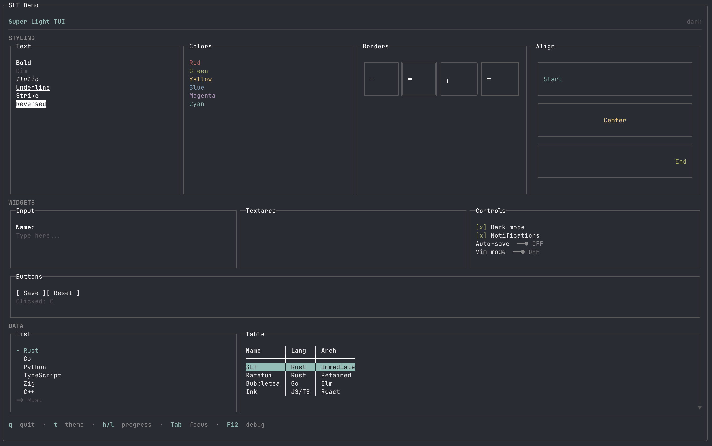
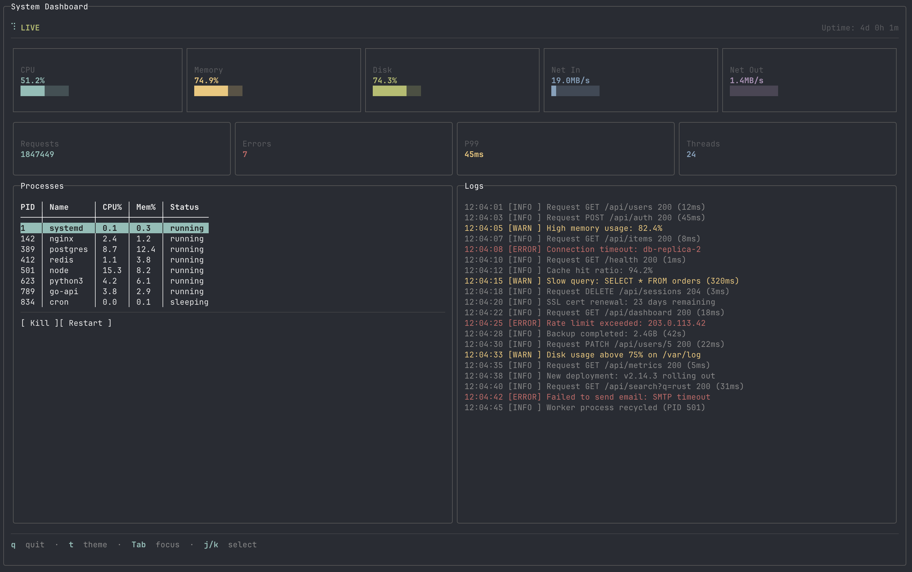
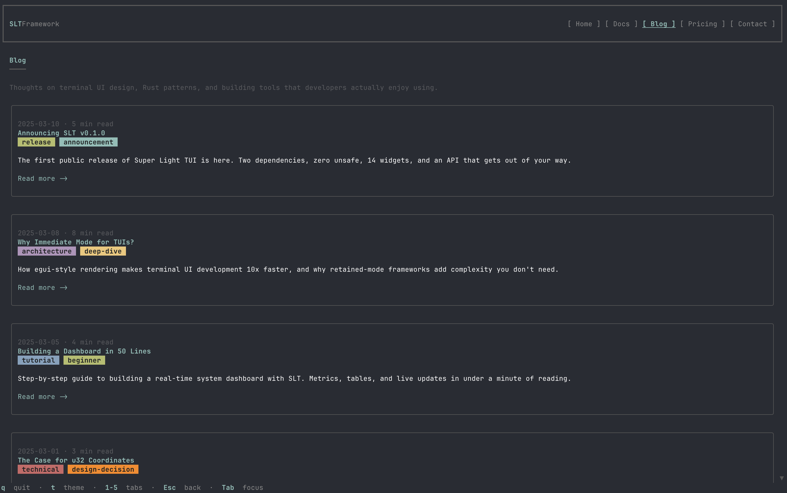
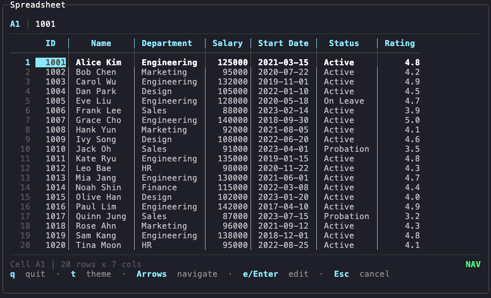
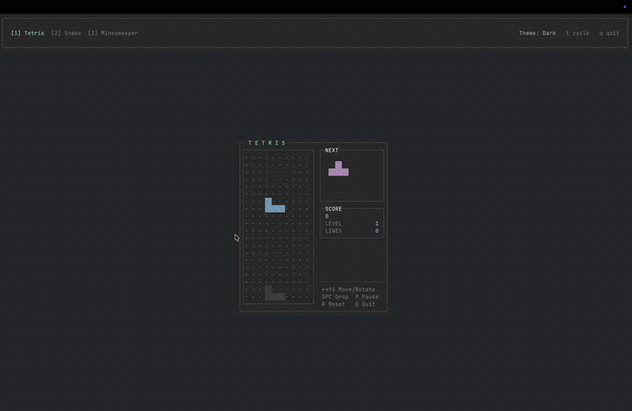
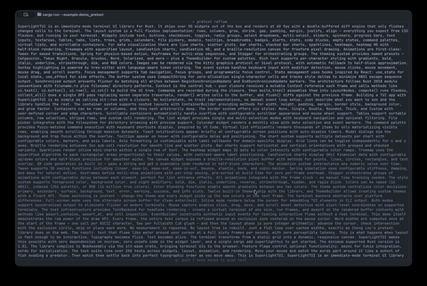
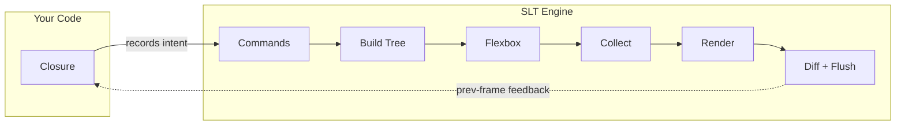

<div align="center">

# SuperLightTUI

**Rápido de escribir. Árbol de dependencias ligero** (4 dependencias directas requeridas, 25 resueltas con las características por defecto, frente a 68 de ratatui + crossterm).

[![Crate Badge]][Crate]
[![Docs Badge]][Docs]
[![CI Badge]][CI]
[![MSRV Badge]][Crate]
[![Downloads Badge]][Crate]
[![License Badge]][License]

[Índice de Docs] · [Inicio Rápido] · [Guía de Widgets] · [Guía de Patrones] · [Ejemplos] · [Guía de Backends] · [Arquitectura]

[English](../README.md) · [中文](README.zh-CN.md) · **Español** · [日本語](README.ja.md) · [한국어](README.ko.md)

</div>

SuperLightTUI es una biblioteca TUI immediate-mode para Rust con una gramática pública deliberadamente pequeña.
Escribes un closure, SLT lo ejecuta en cada frame, y la biblioteca se encarga del layout, el foco, el diff y el renderizado.

Está diseñada para iteración rápida de producto, sintaxis de Rust fácil de leer y disciplina seria en el backend.
Eso hace que encaje igual de bien para personas que prototipan una herramienta y para agentes que generan UI a partir de docs.

## Showcase

<table>
  <tr>
    <td align="center"><br/><b>Widget Demo</b><br/><sub><code>cargo run --example demo</code></sub></td>
    <td align="center"><br/><b>Dashboard</b><br/><sub><code>cargo run --example showcase_tour</code></sub></td>
    <td align="center"><br/><b>Website Layout</b><br/><sub><code>cargo run --example showcase_tour</code></sub></td>
  </tr>
  <tr>
    <td align="center"><br/><b>Spreadsheet</b><br/><sub><code>cargo run --example showcase_tour</code></sub></td>
    <td align="center"><br/><b>Games</b><br/><sub><code>cargo run --example showcase_tour</code></sub></td>
    <td align="center"><br/><b>DOOM Fire Effect</b><br/><sub><code>cargo run --release --example demo_fire</code></sub></td>
  </tr>
  <tr>
    <td align="center" colspan="3"><br/><b><a href="https://github.com/chenglou/pretext">Pretext</a> Reflow</b> — el texto se reorganiza alrededor del cursor del ratón en tiempo real<br/><sub><code>cargo run --example text_tour</code></sub></td>
  </tr>
</table>

## Inicio rápido

```sh
cargo add superlighttui
```

```rust
fn main() -> std::io::Result<()> {
    slt::run(|ui: &mut slt::Context| {
        ui.text("hello, world");
    })
}
```

Cinco líneas y ya arranca. Sin trait `App`. Sin `Model`/`Update`/`View`. Sin bucle de eventos manual. Ctrl+C funciona sin configuración extra.

## Gramática en 60 segundos

La mayoría de las apps empiezan con cuatro ideas:

1. El estado vive en variables o structs normales de Rust.
2. El layout suele resolverse con `row()`, `col()` y `container()`.
3. El estilo se aplica con method chaining.
4. Los widgets interactivos normalmente devuelven `Response`.

```rust
ui.bordered(Border::Rounded).title("Status").p(1).gap(1).col(|ui| {
    ui.text("SLT").bold().fg(Color::Cyan);
    ui.row(|ui| {
        ui.text("mode:");
        ui.text("ready").fg(Color::Green);
        ui.spacer();
        if ui.button("Quit").clicked {
            ui.quit();
        }
    });
});
```

Ese es el mental model central. Lo demás es profundidad, no un segundo framework.

## Una aplicación real

```rust
use slt::{Border, Color, Context, KeyCode};

fn main() -> std::io::Result<()> {
    let mut count: i32 = 0;

    slt::run(|ui: &mut Context| {
        if ui.key('q') {
            ui.quit();
        }
        if ui.key('k') || ui.key_code(KeyCode::Up) {
            count += 1;
        }
        if ui.key('j') || ui.key_code(KeyCode::Down) {
            count -= 1;
        }

        ui.bordered(Border::Rounded).title("Counter").p(1).gap(1).col(|ui| {
            ui.text("Counter").bold().fg(Color::Cyan);
            ui.row(|ui| {
                ui.text("Count:");
                let color = if count >= 0 { Color::Green } else { Color::Red };
                ui.text(format!("{count}")).bold().fg(color);
            });
            ui.text("k +1 / j -1 / q quit").dim();
        });
    })
}
```

## Por qué SLT

- **Gramática pública pequeña**. Muchas pantallas arrancan con estado normal de Rust, `row()` / `col()` / `container()`, method chaining y `Response`.
- **Menos ceremonia de framework**. En muchas apps no hace falta un app trait, un árbol retained ni un enum de mensajes solo para empezar.
- **Baterías incluidas, backend serio**. Los widgets comunes ya resuelven foco, hover, clic y scroll, mientras el runtime mantiene una ruta low-level conservadora a través de `Backend`, `AppState` y `frame()`.
- **Internals conservadores**. SLT mantiene la superficie pública pequeña, pero asegura el interior con shared frame kernel, pruebas explícitas de contrato para backends, cero `unsafe`, rutas runtime detrás de feature flags y validación en `all-features`, `no-default-features`, WASM, clippy, ejemplos, cargo-hack, semver y deny.

Para usuarios de Rust, eso normalmente significa menos configuración inicial que en frameworks TUI retained-mode.
Para flujos asistidos por AI, significa que la gramática pública se infiere con facilidad a partir de docs y ejemplos.

SLT encaja especialmente bien si quieres construir apps de terminal rápido sin renunciar a la seguridad de tipos de Rust ni a escape hatches de backend.
Si buscas un árbol de componentes retained o un toolkit GUI-first, otra biblioteca puede ser mejor opción.

## Cómo renderiza

El pipeline de renderizado de SLT es la razón por la que la gramática se mantiene pequeña.
Tu código solo toca la primera etapa — el motor se encarga del resto.


```mermaid
graph LR
    subgraph your_code ["Your Code"]
        A["Closure"]
    end
    subgraph engine ["SLT Engine"]
        B[Commands] --> C[Build Tree] --> D[Flexbox] --> E[Collect] --> F[Render] --> G["Diff + Flush"]
    end
    A -->|"records intent"| B
    G -.->|"prev-frame feedback"| A
```

Cada llamada a `ui.*()` registra un comando en una lista plana — sin construir árboles, sin cálculo de layout.
El motor pasa esos comandos por un **pipeline DFS de cuatro etapas** — cada etapa se especializa: construir el árbol de layout, calcular flexbox, recoger datos de interacción y feedback, renderizar celdas al back buffer — luego hace diff contra el frame anterior y flush solo lo que cambió.

Esta arquitectura es lo que hace posible la gramática simple:

- **Sin ceremonia.** Immediate-mode significa que no hay trait `App`, ni `Model`/`Message`/`Update`/`View`. Tu closure es toda la UI. El estado son variables normales de Rust. El flujo de control es `if`/`for`.
- **Layout invisible.** `ui.col(|ui| { ... })` registra un comando "abrir columna". El motor construye el árbol y ejecuta flexbox — nunca ves `LayoutNode`.
- **Rendimiento automático.** El doble buffer compara celdas entre frames y solo emite los atributos ANSI que cambiaron. Redibujas todo cada frame; el motor lo hace rápido. Sin dirty tracking manual.
- **Interacción auto-cableada.** `ui.button("Save")` te da hover, click y foco gratis. La etapa de recolección fusionó siete sub-recorridos independientes (hit areas, focus rects, scroll regions, group rects, content rects, focus groups, raw-draw rects) en un solo DFS — así el pipeline de nivel superior son cuatro pasadas, no diez.
- **Feedback síncrono.** La interacción usa las posiciones de layout del frame anterior (imperceptible a 60 FPS). Sin callbacks, sin queries de layout async — tu código se mantiene lineal.

Para el ciclo de vida completo de ocho etapas, consulta la [Arquitectura].

## Superficie común de API

```rust
// Texto y layout
ui.text("Hello").bold().fg(Color::Cyan);
ui.row(|ui| {
    ui.text("left");
    ui.spacer();
    ui.text("right");
});

// Entradas y acciones
ui.text_input(&mut name);
if ui.button("Save").clicked {}
ui.checkbox("Dark mode", &mut dark);

// Datos y navegación
ui.tabs(&mut tabs);
ui.list(&mut items);
ui.table(&mut data);
ui.command_palette(&mut palette);

// Overlays y salida enriquecida
ui.toast(&mut toasts);
ui.modal(|ui| {
    ui.text("Confirm?").bold();
});
ui.markdown("# Hello **world**");

// Visualización
ui.chart(|c| {
    c.line(&data);
    c.grid(true);
}, 50, 16);
ui.sparkline(&values, 16);
ui.canvas(40, 10, |cv| {
    cv.circle(20, 20, 15);
});
```

Para la lista categorizada de widgets, consulta la [Guía de Widgets]. Para composición y organización, mira la [Guía de Patrones].

## Aprende la biblioteca

| Documento | Qué cubre |
|-----------|-----------|
| [Índice de Docs] | Estructura completa de la documentación y mapa de guías |
| [Inicio Rápido] | Instalación, primera app, mental model del closure, layout y estado de widgets |
| [Guía de Widgets] | Catálogo completo de widgets, métodos del runtime y tipos de estado |
| [Guía de Patrones] | Ubicación del estado, composición de pantallas, extracción de helpers y estructura para apps grandes |
| [Ejemplos] | Ejemplos ejecutables agrupados por forma de producto y área funcional |
| [Guía de Backends] | `Backend`, `AppState`, `frame()`, modo inline y salida estática |
| [Guía de Testing] | `TestBackend`, `EventBuilder`, pruebas multi-frame y contratos de backend |
| [Guía de Depuración] | Overlay F12, clipping, sorpresas de foco y comportamiento del frame anterior |
| [Guía AI] | Camino más rápido para builders asistidos por AI y agentes de código |
| [Arquitectura] | Mapa de módulos, ciclo de vida del frame y pipeline layout/render |
| [Guía de Características] | Feature flags, dependencias opcionales y combinaciones recomendadas |
| [Guía de Animación] | Tween, spring, keyframes, sequence y stagger |
| [Guía de Temas] | `Theme`, presets, `ThemeBuilder` y temas personalizados |
| [Principios de Diseño] | Restricciones de API y filosofía de diseño |

## Ejemplos representativos

| Ejemplo | Comando | Enfoque |
|---------|---------|---------|
| `hello` | `cargo run --example hello` | La app más pequeña posible |
| `counter` | `cargo run --example counter` | Estado + entrada de teclado |
| `demo` | `cargo run --example demo` | Recorrido amplio de widgets |
| `demo_dashboard` | `cargo run --example showcase_tour` | Layout de dashboard |
| `demo_cli` | `cargo run --example showcase_tour` | Layout de herramienta CLI |
| `demo_infoviz` | `cargo run --example showcase_tour` | Gráficos y visualización de datos |
| `demo_game` | `cargo run --example showcase_tour` | Interacción immediate-mode |
| `demo_design_system` | `cargo run --example showcase_tour` | Design tokens, temas, herencia de estilos |
| `inline` | `cargo run --example system_tour` | Render inline bajo un prompt normal |
| `async_demo` | `cargo run --example system_tour --features async` | Mensajes en segundo plano |

El índice completo categorizado está en [Ejemplos].

## Widgets personalizados y backends

- Implementa `Widget` si quieres bloques reutilizables de alto nivel.
- Implementa `Backend` y controla `frame()` si necesitas un destino no terminal, un event loop externo o un runtime embebido.
- Usa `TestBackend` para validar render headless y pruebas de interacción estables.

La gramática pública sigue siendo pequeña incluso cuando necesitas escape hatches.

## Contribuir

Lee [Contribuir] y luego revisa [Principios de Diseño] y [Arquitectura].
El proceso de release asume que format, check, clippy, tests, ejemplos y backend gates se mantienen en verde.

## Licencia

[MIT](../LICENSE)

<!-- Badge definitions -->
[Crate Badge]: https://img.shields.io/crates/v/superlighttui?style=flat-square&logo=rust&color=E05D44
[Docs Badge]: https://img.shields.io/docsrs/superlighttui?style=flat-square&logo=docs.rs
[CI Badge]: https://img.shields.io/github/actions/workflow/status/subinium/SuperLightTUI/ci.yml?branch=main&style=flat-square&label=CI
[MSRV Badge]: https://img.shields.io/crates/msrv/superlighttui?style=flat-square&label=MSRV
[Downloads Badge]: https://img.shields.io/crates/d/superlighttui?style=flat-square
[License Badge]: https://img.shields.io/crates/l/superlighttui?style=flat-square&color=1370D3

<!-- Link definitions -->
[CI]: https://github.com/subinium/SuperLightTUI/actions/workflows/ci.yml
[Crate]: https://crates.io/crates/superlighttui
[Docs]: https://docs.rs/superlighttui
[Índice de Docs]: README.md
[Inicio Rápido]: QUICK_START.md
[Guía de Widgets]: WIDGETS.md
[Ejemplos]: EXAMPLES.md
[Guía de Patrones]: PATTERNS.md
[Arquitectura]: ARCHITECTURE.md
[Guía de Backends]: BACKENDS.md
[Guía de Testing]: TESTING.md
[Guía de Depuración]: DEBUGGING.md
[Guía AI]: AI_GUIDE.md
[Guía de Animación]: ANIMATION.md
[Guía de Temas]: THEMING.md
[Guía de Características]: FEATURES.md
[Principios de Diseño]: DESIGN_PRINCIPLES.md
[Contribuir]: ../CONTRIBUTING.md
[License]: ../LICENSE
