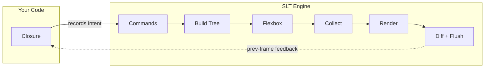

<div align="center">

# SuperLightTUI

**書くのは速く。動くのは軽く。**

[![Crate Badge]][Crate]
[![Docs Badge]][Docs]
[![CI Badge]][CI]
[![MSRV Badge]][Crate]
[![Downloads Badge]][Crate]
[![License Badge]][License]

[ドキュメント] · [クイックスタート] · [ウィジェットガイド] · [パターンガイド] · [サンプル集] · [バックエンドガイド] · [アーキテクチャ]

[English](../README.md) · [中文](README.zh-CN.md) · [Español](README.es.md) · **日本語** · [한국어](README.ko.md)

</div>

SuperLightTUI は、公開される文法を意図的に小さく保った Rust 向けの immediate-mode TUI ライブラリです。
クロージャを 1 つ書けば、SLT が毎フレームそれを呼び出し、レイアウト、フォーカス、差分計算、レンダリングを処理します。

高速なプロダクト反復、読みやすい Rust 構文、そして真面目なバックエンド規律を両立するために設計されています。
そのため、ツールを素早く試作する人にも、ドキュメントから UI を生成するコーディングエージェントにも自然に合います。

## ショーケース

<table>
  <tr>
    <td align="center"><br/><b>Widget Demo</b><br/><sub><code>cargo run --example demo</code></sub></td>
    <td align="center"><br/><b>Dashboard</b><br/><sub><code>cargo run --example demo_dashboard</code></sub></td>
    <td align="center"><br/><b>Website Layout</b><br/><sub><code>cargo run --example demo_website</code></sub></td>
  </tr>
  <tr>
    <td align="center"><br/><b>Spreadsheet</b><br/><sub><code>cargo run --example demo_spreadsheet</code></sub></td>
    <td align="center"><br/><b>Games</b><br/><sub><code>cargo run --example demo_game</code></sub></td>
    <td align="center"><br/><b>DOOM Fire Effect</b><br/><sub><code>cargo run --release --example demo_fire</code></sub></td>
  </tr>
  <tr>
    <td align="center" colspan="3"><br/><b><a href="https://github.com/chenglou/pretext">Pretext</a> Reflow</b> — マウスカーソルの周りでテキストがリアルタイムに再配置されます<br/><sub><code>cargo run --example demo_pretext</code></sub></td>
  </tr>
</table>

## クイックスタート

```sh
cargo add superlighttui
```

```rust
fn main() -> std::io::Result<()> {
    slt::run(|ui: &mut slt::Context| {
        ui.text("hello, world");
    })
}
```

5 行で始められます。`App` トレイトも、`Model`/`Update`/`View` も、手書きのイベントループも不要です。Ctrl+C もそのまま動作します。

## 60 秒でわかる文法

多くのアプリは次の 4 つから始まります。

1. 状態は普通の Rust の変数や構造体に置く。
2. レイアウトは主に `row()`、`col()`、`container()` で組む。
3. スタイルはメソッドチェーンで付ける。
4. インタラクティブなウィジェットはたいてい `Response` を返す。

```rust
ui.bordered(Border::Rounded).title("Status").p(1).gap(1).col(|ui| {
    ui.text("SLT").bold().fg(Color::Cyan);
    ui.row(|ui| {
        ui.text("mode:");
        ui.text("ready").fg(Color::Green);
        ui.spacer();
        if ui.button("Quit").clicked {
            ui.quit();
        }
    });
});
```

これが中核となる mental model です。残りは別フレームワークではなく、深さと拡張です。

## 実際のアプリ

```rust
use slt::{Border, Color, Context, KeyCode};

fn main() -> std::io::Result<()> {
    let mut count: i32 = 0;

    slt::run(|ui: &mut Context| {
        if ui.key('q') {
            ui.quit();
        }
        if ui.key('k') || ui.key_code(KeyCode::Up) {
            count += 1;
        }
        if ui.key('j') || ui.key_code(KeyCode::Down) {
            count -= 1;
        }

        ui.bordered(Border::Rounded).title("Counter").p(1).gap(1).col(|ui| {
            ui.text("Counter").bold().fg(Color::Cyan);
            ui.row(|ui| {
                ui.text("Count:");
                let color = if count >= 0 { Color::Green } else { Color::Red };
                ui.text(format!("{count}")).bold().fg(color);
            });
            ui.text("k +1 / j -1 / q quit").dim();
        });
    })
}
```

## なぜ SLT か

- **公開文法が小さい**。多くの画面は普通の Rust の状態、`row()` / `col()` / `container()`、メソッドチェーン、`Response` で始められます。
- **フレームワークの儀式が少ない**。動き始めるために app trait、retained tree、message enum を先に用意しなくてよいケースが多いです。
- **部品は充実していて、バックエンドは真面目**。共通ウィジェットが focus、hover、click、scroll を自動で結び付け、内部ランタイムは `Backend`、`AppState`、`frame()` を通して保守的な低レベル経路を維持します。
- **内部実装も保守的に固めています**。shared frame kernel、明示的な backend contract test、zero `unsafe`、feature-gated runtime path、`all-features`/`no-default-features`/WASM/clippy/examples/cargo-hack/semver/deny の検証で品質を固定しています。

Rust ユーザーにとっては、retained-mode の TUI フレームワークより初期設定が少なくて済むことが多いです。
AI 支援ワークフローにとっては、ドキュメントとサンプルから公開文法を推測しやすいという意味でもあります。

SLT は、Rust の型安全性やバックエンドの escape hatch を保ったまま、ターミナルアプリを素早く作りたいときに特に向いています。
一方で、retained component tree を主軸にしたい場合や GUI-first のツールキットが欲しい場合は、別のライブラリのほうが適しているかもしれません。

## レンダリングの仕組み

SLT のレンダリングパイプラインが、文法を小さく保てる理由です。
あなたのコードが触れるのは最初のステージだけ — 残りはエンジンが処理します。



`ui.*()` の呼び出しはコマンドをフラットリストに記録するだけ — ツリー構築もレイアウト計算もしません。
エンジンがそれらのコマンドを**4 ステージの DFS パイプライン**に通します — 各ステージが専門化されています: レイアウトツリー構築、flexbox 計算、インタラクションとフィードバックデータの収集、バックバッファへのセル描画 — その後、前フレームとの diff を取り、変更分だけ flush します。

このアーキテクチャが文法をシンプルにできる理由です:

- **儀式がありません。** Immediate-mode なので `App` トレイト、`Model`/`Message`/`Update`/`View` は不要です。クロージャが UI そのもの。状態は普通の Rust 変数、制御フローは `if`/`for` です。
- **レイアウトが見えません。** `ui.col(|ui| { ... })` は「カラムを開く」コマンドを記録します。エンジンがツリーを構築し flexbox を実行 — `LayoutNode` は露出しません。
- **パフォーマンスが自動です。** ダブルバッファがフレーム間でセルを比較し、変更された ANSI 属性だけを出力します。毎フレーム全体を再描画しても、エンジンが高速に処理します。手動の dirty tracking は不要です。
- **インタラクションが自動接続されます。** `ui.button("Save")` だけで hover、click、focus が無料で得られます。collect ステージは 7 つの独立したサブ走査（ヒット領域、focus rect、スクロール領域、group rect、content rect、focus group、raw-draw rect）を 1 回の DFS に統合しました — そのため最上位パイプラインは 4 パスであり、10 パスではありません。
- **同期的フィードバック。** インタラクションは前フレームのレイアウト位置を使います（60 FPS では知覚不可能）。コールバックも async レイアウトクエリも不要 — コードはリニアなままです。

完全な 8 ステージのライフサイクルは [アーキテクチャ] を参照してください。

## よく使う API

```rust
// テキストとレイアウト
ui.text("Hello").bold().fg(Color::Cyan);
ui.row(|ui| {
    ui.text("left");
    ui.spacer();
    ui.text("right");
});

// 入力とアクション
ui.text_input(&mut name);
if ui.button("Save").clicked {}
ui.checkbox("Dark mode", &mut dark);

// データとナビゲーション
ui.tabs(&mut tabs);
ui.list(&mut items);
ui.table(&mut data);
ui.command_palette(&mut palette);

// オーバーレイとリッチ出力
ui.toast(&mut toasts);
ui.modal(|ui| {
    ui.text("Confirm?").bold();
});
ui.markdown("# Hello **world**");

// 可視化
ui.chart(|c| {
    c.line(&data);
    c.grid(true);
}, 50, 16);
ui.sparkline(&values, 16);
ui.canvas(40, 10, |cv| {
    cv.circle(20, 20, 15);
});
```

分類済みの一覧は [ウィジェットガイド]、組み合わせ方の考え方は [パターンガイド] を参照してください。

## ライブラリを学ぶ

| ドキュメント | 内容 |
|-------------|------|
| [ドキュメント] | ドキュメント全体の構造とガイドマップ |
| [クイックスタート] | インストール、最初のアプリ、クロージャの mental model、レイアウト、ウィジェット状態 |
| [ウィジェットガイド] | ウィジェット、ランタイムメソッド、状態型の完全カタログ |
| [パターンガイド] | 状態配置、画面分割、ヘルパー抽出、大きなアプリの構造 |
| [サンプル集] | プロダクト形状や機能別に整理した実行可能サンプル |
| [バックエンドガイド] | `Backend`、`AppState`、`frame()`、inline mode、static output |
| [テストガイド] | `TestBackend`、`EventBuilder`、multi-frame test、backend contract test |
| [デバッグガイド] | F12 オーバーレイ、clipping、focus の意外な挙動、previous-frame behavior |
| [AIガイド] | AI ビルダーやコーディングエージェント向けの最短導線 |
| [アーキテクチャ] | モジュールマップ、フレームライフサイクル、layout/render パイプライン |
| [機能フラグガイド] | feature flag、optional dependency、推奨組み合わせ |
| [アニメーションガイド] | Tween、spring、keyframe、sequence、stagger |
| [テーマガイド] | Theme struct、preset、ThemeBuilder、カスタムテーマ |
| [設計原則] | API の制約と設計哲学 |

## 代表的なサンプル

| サンプル | コマンド | 焦点 |
|---------|---------|------|
| `hello` | `cargo run --example hello` | 最小のアプリ |
| `counter` | `cargo run --example counter` | 状態 + キーボード入力 |
| `demo` | `cargo run --example demo` | 幅広いウィジェットツアー |
| `demo_dashboard` | `cargo run --example demo_dashboard` | ダッシュボードレイアウト |
| `demo_cli` | `cargo run --example demo_cli` | CLI ツールのレイアウト |
| `demo_infoviz` | `cargo run --example demo_infoviz` | チャートとデータ可視化 |
| `demo_game` | `cargo run --example demo_game` | immediate-mode のインタラクション |
| `demo_design_system` | `cargo run --example demo_design_system` | デザイントークン、テーマ、スタイル継承 |
| `inline` | `cargo run --example inline` | 通常のプロンプトの下に inline 描画 |
| `async_demo` | `cargo run --example async_demo --features async` | バックグラウンドメッセージ |

分類済みの完全な一覧は [サンプル集] にあります。

## カスタムウィジェットとバックエンド

- 再利用できる高レベルの部品が欲しいなら `Widget` を実装します。
- ターミナル以外の描画先、外部イベントループ、組み込みランタイムが必要なら `Backend` を実装して `frame()` を駆動します。
- ヘッドレスな描画確認と安定したインタラクションテストには `TestBackend` を使います。

escape hatch が必要になっても、公開文法は小さいままです。

## コントリビューション

[コントリビュート] を読んだ後、[設計原則] と [アーキテクチャ] を参照してください。
リリース工程では format、check、clippy、test、example、backend gate が通り続けることを前提にしています。

## ライセンス

[MIT](../LICENSE)

<!-- Badge definitions -->
[Crate Badge]: https://img.shields.io/crates/v/superlighttui?style=flat-square&logo=rust&color=E05D44
[Docs Badge]: https://img.shields.io/docsrs/superlighttui?style=flat-square&logo=docs.rs
[CI Badge]: https://img.shields.io/github/actions/workflow/status/subinium/SuperLightTUI/ci.yml?branch=main&style=flat-square&label=CI
[MSRV Badge]: https://img.shields.io/crates/msrv/superlighttui?style=flat-square&label=MSRV
[Downloads Badge]: https://img.shields.io/crates/d/superlighttui?style=flat-square
[License Badge]: https://img.shields.io/crates/l/superlighttui?style=flat-square&color=1370D3

<!-- Link definitions -->
[CI]: https://github.com/subinium/SuperLightTUI/actions/workflows/ci.yml
[Crate]: https://crates.io/crates/superlighttui
[Docs]: https://docs.rs/superlighttui
[ドキュメント]: README.md
[クイックスタート]: QUICK_START.md
[ウィジェットガイド]: WIDGETS.md
[サンプル集]: EXAMPLES.md
[パターンガイド]: PATTERNS.md
[アーキテクチャ]: ARCHITECTURE.md
[バックエンドガイド]: BACKENDS.md
[テストガイド]: TESTING.md
[デバッグガイド]: DEBUGGING.md
[AIガイド]: AI_GUIDE.md
[アニメーションガイド]: ANIMATION.md
[テーマガイド]: THEMING.md
[機能フラグガイド]: FEATURES.md
[設計原則]: DESIGN_PRINCIPLES.md
[コントリビュート]: ../CONTRIBUTING.md
[License]: ../LICENSE
