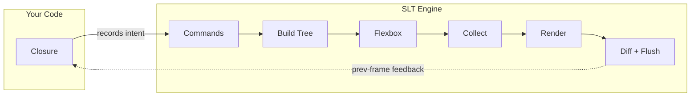

<div align="center">

# SuperLightTUI

**빠르게 만들고. 가볍게 실행합니다.**

[![Crate Badge]][Crate]
[![Docs Badge]][Docs]
[![CI Badge]][CI]
[![MSRV Badge]][Crate]
[![Downloads Badge]][Crate]
[![License Badge]][License]

[문서 인덱스] · [빠른 시작] · [위젯 가이드] · [패턴 가이드] · [예제 가이드] · [백엔드 가이드] · [아키텍처 가이드]

[English](../README.md) · [中文](README.zh-CN.md) · [Español](README.es.md) · [日本語](README.ja.md) · **한국어**

</div>

SuperLightTUI는 Rust를 위한 immediate-mode TUI 라이브러리로, public grammar를 의도적으로 작게 유지합니다.
클로저 하나를 쓰면 SLT가 매 프레임 그 클로저를 호출하고, 라이브러리가 레이아웃, 포커스, diff, 렌더링을 처리합니다.

빠른 제품 반복, 읽기 쉬운 Rust 문법, 그리고 진지한 백엔드 규율을 함께 가져가도록 설계했습니다.
그래서 도구를 빠르게 시제품화하는 사람에게도, 문서로 UI를 생성하는 코딩 에이전트에게도 자연스럽게 맞습니다.

## 쇼케이스

<table>
  <tr>
    <td align="center"><br/><b>Widget Demo</b><br/><sub><code>cargo run --example demo</code></sub></td>
    <td align="center"><br/><b>Dashboard</b><br/><sub><code>cargo run --example demo_dashboard</code></sub></td>
    <td align="center"><br/><b>Website Layout</b><br/><sub><code>cargo run --example demo_website</code></sub></td>
  </tr>
  <tr>
    <td align="center"><br/><b>Spreadsheet</b><br/><sub><code>cargo run --example demo_spreadsheet</code></sub></td>
    <td align="center"><br/><b>Games</b><br/><sub><code>cargo run --example demo_game</code></sub></td>
    <td align="center"><br/><b>DOOM Fire Effect</b><br/><sub><code>cargo run --release --example demo_fire</code></sub></td>
  </tr>
  <tr>
    <td align="center" colspan="3"><br/><b><a href="https://github.com/chenglou/pretext">Pretext</a> Reflow</b> — 마우스 커서 주변으로 텍스트가 실시간 재배치됩니다<br/><sub><code>cargo run --example demo_pretext</code></sub></td>
  </tr>
</table>

## 빠른 시작

```sh
cargo add superlighttui
```

```rust
fn main() -> std::io::Result<()> {
    slt::run(|ui: &mut slt::Context| {
        ui.text("hello, world");
    })
}
```

5줄이면 시작됩니다. `App` 트레이트도, `Model`/`Update`/`View`도, 수동 이벤트 루프도 필요 없습니다. Ctrl+C도 바로 동작합니다.

## 60초 문법

대부분의 앱은 네 가지 개념으로 시작합니다.

1. 상태는 일반적인 Rust 변수나 구조체에 둡니다.
2. 레이아웃은 대부분 `row()`, `col()`, `container()`로 충분합니다.
3. 스타일링은 메서드 체이닝으로 끝납니다.
4. 상호작용 위젯은 보통 `Response`를 돌려줍니다.

```rust
ui.bordered(Border::Rounded).title("Status").p(1).gap(1).col(|ui| {
    ui.text("SLT").bold().fg(Color::Cyan);
    ui.row(|ui| {
        ui.text("mode:");
        ui.text("ready").fg(Color::Green);
        ui.spacer();
        if ui.button("Quit").clicked {
            ui.quit();
        }
    });
});
```

이게 핵심 mental model입니다. 나머지는 별도의 프레임워크가 아니라 깊이와 확장입니다.

## 실제 앱

```rust
use slt::{Border, Color, Context, KeyCode};

fn main() -> std::io::Result<()> {
    let mut count: i32 = 0;

    slt::run(|ui: &mut Context| {
        if ui.key('q') {
            ui.quit();
        }
        if ui.key('k') || ui.key_code(KeyCode::Up) {
            count += 1;
        }
        if ui.key('j') || ui.key_code(KeyCode::Down) {
            count -= 1;
        }

        ui.bordered(Border::Rounded).title("Counter").p(1).gap(1).col(|ui| {
            ui.text("Counter").bold().fg(Color::Cyan);
            ui.row(|ui| {
                ui.text("Count:");
                let color = if count >= 0 { Color::Green } else { Color::Red };
                ui.text(format!("{count}")).bold().fg(color);
            });
            ui.text("k +1 / j -1 / q quit").dim();
        });
    })
}
```

## 왜 SLT인가

- **작은 public grammar**. 대부분의 화면은 일반 Rust 상태, `row()` / `col()` / `container()`, 메서드 체이닝, `Response`로 시작합니다.
- **프레임워크 의식이 적습니다**. 움직이기 위해 앱 트레이트, retained tree, 메시지 enum을 먼저 만들 필요가 없는 경우가 많습니다.
- **기본기는 풍부하지만 백엔드는 진지합니다**. 공용 위젯이 포커스, hover, 클릭, scroll을 기본으로 연결해 주고, 내부 런타임은 `Backend`, `AppState`, `frame()`으로 보수적인 low-level 경로를 유지합니다.
- **내부 구현도 보수적으로 다집니다**. shared frame kernel, explicit backend contract test, zero `unsafe`, feature-gated runtime path, `all-features`/`no-default-features`/WASM/clippy/examples/cargo-hack/semver/deny 검증으로 품질을 잠급니다.

Rust 사용자에게는 retained-mode TUI보다 초기 설정이 덜한 경우가 많습니다.
AI 보조 워크플로에서는 문서와 예제만으로도 public grammar를 추론하기 쉽다는 뜻이기도 합니다.

SLT는 Rust의 타입 안정성을 유지하면서 빠르게 터미널 앱을 만들고 싶을 때 특히 잘 맞습니다.
반대로 retained component tree가 중심이거나 GUI-first 툴킷이 필요하다면 다른 선택지가 더 잘 맞을 수 있습니다.

## 렌더링 파이프라인

SLT의 렌더링 파이프라인 덕분에 문법이 작게 유지됩니다.
여러분의 코드는 첫 단계만 담당하고, 나머지는 엔진이 처리합니다.



`ui.*()` 호출은 커맨드를 flat list에 기록합니다 — 트리 구성도, 레이아웃 계산도 없습니다.
엔진이 이 커맨드를 파이프라인에 통과시킵니다: 레이아웃 트리 생성, flexbox 계산, 히트 영역과 포커스 그룹을 단일 DFS로 수집, back buffer에 셀 렌더링, 이전 프레임과 diff 후 변경분만 flush.

이 아키텍처가 문법을 단순하게 만드는 이유입니다:

- **의식 절차가 없습니다.** Immediate-mode이므로 `App` 트레이트, `Model`/`Message`/`Update`/`View`가 필요 없습니다. 클로저가 전체 UI이고, 상태는 일반 Rust 변수, 제어 흐름은 `if`/`for`입니다.
- **레이아웃이 보이지 않습니다.** `ui.col(|ui| { ... })`는 "open column" 커맨드를 기록합니다. 엔진이 트리를 빌드하고 flexbox를 실행합니다 — `LayoutNode`는 노출되지 않습니다.
- **성능이 자동입니다.** 더블 버퍼가 프레임 간 셀을 비교하고 변경된 ANSI 속성만 출력합니다. 매 프레임 전체를 다시 그리지만 엔진이 빠르게 처리합니다. 수동 dirty tracking이 필요 없습니다.
- **상호작용이 자동 연결됩니다.** `ui.button("Save")`만으로 hover, click, focus가 제공됩니다. `collect_all()`이 단일 DFS로 모든 상호작용 데이터를 수집하며, 기존 7개 트리 순회를 대체합니다.
- **동기적 피드백.** 상호작용은 이전 프레임의 레이아웃 위치를 사용합니다(60 FPS에서 감지 불가). 콜백도 async 레이아웃 쿼리도 없이 코드가 선형으로 유지됩니다.

전체 8단계 라이프사이클은 [아키텍처 가이드]를 참고하세요.

## 자주 쓰는 API

```rust
// 텍스트와 레이아웃
ui.text("Hello").bold().fg(Color::Cyan);
ui.row(|ui| {
    ui.text("left");
    ui.spacer();
    ui.text("right");
});

// 입력과 액션
ui.text_input(&mut name);
if ui.button("Save").clicked {}
ui.checkbox("Dark mode", &mut dark);

// 데이터와 네비게이션
ui.tabs(&mut tabs);
ui.list(&mut items);
ui.table(&mut data);
ui.command_palette(&mut palette);

// 오버레이와 리치 출력
ui.toast(&mut toasts);
ui.modal(|ui| {
    ui.text("Confirm?").bold();
});
ui.markdown("# Hello **world**");

// 시각화
ui.chart(|c| {
    c.line(&data);
    c.grid(true);
}, 50, 16);
ui.sparkline(&values, 16);
ui.canvas(40, 10, |cv| {
    cv.circle(20, 20, 15);
});
```

분류된 전체 위젯 목록은 [위젯 가이드]를, 조합 패턴은 [패턴 가이드]를 참고하세요.

## 라이브러리 익히기

| 문서 | 내용 |
|------|------|
| [문서 인덱스] | 전체 문서 구조와 가이드 맵 |
| [빠른 시작] | 설치, 첫 앱, 클로저 mental model, 레이아웃, 위젯 상태 |
| [위젯 가이드] | 위젯, 런타임 메서드, 상태 타입 전체 카탈로그 |
| [패턴 가이드] | 상태 배치, 화면 조합, helper 추출, 큰 앱 구조 |
| [예제 가이드] | 제품 형태와 기능 영역별로 정리된 실행 예제 |
| [백엔드 가이드] | `Backend`, `AppState`, `frame()`, inline mode, static output |
| [테스트 가이드] | `TestBackend`, `EventBuilder`, multi-frame test, backend contract test |
| [디버깅 가이드] | F12 오버레이, clipping, focus surprise, previous-frame behavior |
| [AI 가이드] | AI 빌더와 코딩 에이전트를 위한 가장 빠른 진입 경로 |
| [아키텍처 가이드] | 모듈 맵, 프레임 라이프사이클, layout/render 파이프라인 |
| [기능 가이드] | feature flag, optional dependency, 추천 조합 |
| [애니메이션 가이드] | Tween, spring, keyframe, sequence, stagger |
| [테마 가이드] | Theme struct, preset, ThemeBuilder, 커스텀 테마 |
| [설계 원칙] | API 제약과 설계 철학 |

## 대표 예제

| 예제 | 커맨드 | 초점 |
|------|--------|------|
| `hello` | `cargo run --example hello` | 가장 작은 앱 |
| `counter` | `cargo run --example counter` | 상태 + 키보드 입력 |
| `demo` | `cargo run --example demo` | 폭넓은 위젯 투어 |
| `demo_dashboard` | `cargo run --example demo_dashboard` | 대시보드 레이아웃 |
| `demo_cli` | `cargo run --example demo_cli` | CLI 도구 레이아웃 |
| `demo_infoviz` | `cargo run --example demo_infoviz` | 차트와 데이터 시각화 |
| `demo_game` | `cargo run --example demo_game` | immediate-mode 상호작용 |
| `demo_design_system` | `cargo run --example demo_design_system` | 디자인 토큰, 테마, 스타일 상속 |
| `inline` | `cargo run --example inline` | 일반 프롬프트 아래 inline 렌더링 |
| `async_demo` | `cargo run --example async_demo --features async` | 백그라운드 메시지 |

전체 분류 인덱스는 [예제 가이드]에 있습니다.

## 커스텀 위젯과 백엔드

- 재사용 가능한 고수준 빌딩 블록이 필요하면 `Widget`을 구현하세요.
- 비터미널 타깃, 외부 이벤트 루프, 임베디드 런타임이 필요하면 `Backend`를 구현하고 `frame()`을 구동하세요.
- 헤드리스 렌더링 검증과 안정적인 상호작용 테스트에는 `TestBackend`를 쓰면 됩니다.

escape hatch가 필요해져도 public grammar는 작게 유지됩니다.

## 기여

[기여하기]를 읽고, 이어서 [설계 원칙]과 [아키텍처 가이드]를 참고하세요.
릴리즈 과정에서는 format, check, clippy, test, example, backend gate가 계속 녹색이어야 합니다.

## 라이선스

[MIT](../LICENSE)

<!-- Badge definitions -->
[Crate Badge]: https://img.shields.io/crates/v/superlighttui?style=flat-square&logo=rust&color=E05D44
[Docs Badge]: https://img.shields.io/docsrs/superlighttui?style=flat-square&logo=docs.rs
[CI Badge]: https://img.shields.io/github/actions/workflow/status/subinium/SuperLightTUI/ci.yml?branch=main&style=flat-square&label=CI
[MSRV Badge]: https://img.shields.io/crates/msrv/superlighttui?style=flat-square&label=MSRV
[Downloads Badge]: https://img.shields.io/crates/d/superlighttui?style=flat-square
[License Badge]: https://img.shields.io/crates/l/superlighttui?style=flat-square&color=1370D3

<!-- Link definitions -->
[CI]: https://github.com/subinium/SuperLightTUI/actions/workflows/ci.yml
[Crate]: https://crates.io/crates/superlighttui
[Docs]: https://docs.rs/superlighttui
[License]: ../LICENSE
[문서 인덱스]: README.md
[빠른 시작]: QUICK_START.md
[위젯 가이드]: WIDGETS.md
[예제 가이드]: EXAMPLES.md
[패턴 가이드]: PATTERNS.md
[아키텍처 가이드]: ARCHITECTURE.md
[백엔드 가이드]: BACKENDS.md
[테스트 가이드]: TESTING.md
[디버깅 가이드]: DEBUGGING.md
[AI 가이드]: AI_GUIDE.md
[애니메이션 가이드]: ANIMATION.md
[테마 가이드]: THEMING.md
[기능 가이드]: FEATURES.md
[설계 원칙]: DESIGN_PRINCIPLES.md
[기여하기]: ../CONTRIBUTING.md
