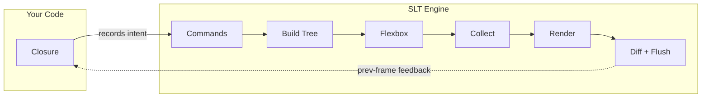

<div align="center">

# SuperLightTUI

**写得快。跑得轻。**

[![Crate Badge]][Crate]
[![Docs Badge]][Docs]
[![CI Badge]][CI]
[![MSRV Badge]][Crate]
[![Downloads Badge]][Crate]
[![License Badge]][License]

[文档索引] · [快速开始] · [组件指南] · [模式指南] · [示例指南] · [后端指南] · [架构指南]

[English](../README.md) · **中文** · [Español](README.es.md) · [日本語](README.ja.md) · [한국어](README.ko.md)

</div>

SuperLightTUI 是一个为 Rust 提供的 immediate-mode TUI 库，并且有意把公开语法保持得很小。
你只需要写一个闭包，SLT 会在每一帧调用它，库本身负责布局、焦点、差分和渲染。

它面向快速产品迭代、易读的 Rust 语法，以及认真的后端纪律。
这让它同样适合快速做工具原型的人，也适合根据文档生成 UI 的 coding agent。

## 效果展示

<table>
  <tr>
    <td align="center"><br/><b>Widget Demo</b><br/><sub><code>cargo run --example demo</code></sub></td>
    <td align="center"><br/><b>Dashboard</b><br/><sub><code>cargo run --example demo_dashboard</code></sub></td>
    <td align="center"><br/><b>Website Layout</b><br/><sub><code>cargo run --example demo_website</code></sub></td>
  </tr>
  <tr>
    <td align="center"><br/><b>Spreadsheet</b><br/><sub><code>cargo run --example demo_spreadsheet</code></sub></td>
    <td align="center"><br/><b>Games</b><br/><sub><code>cargo run --example demo_game</code></sub></td>
    <td align="center"><br/><b>DOOM Fire Effect</b><br/><sub><code>cargo run --release --example demo_fire</code></sub></td>
  </tr>
  <tr>
    <td align="center" colspan="3"><br/><b><a href="https://github.com/chenglou/pretext">Pretext</a> Reflow</b> — 文本围绕鼠标光标实时重排<br/><sub><code>cargo run --example demo_pretext</code></sub></td>
  </tr>
</table>

## 快速开始

```sh
cargo add superlighttui
```

```rust
fn main() -> std::io::Result<()> {
    slt::run(|ui: &mut slt::Context| {
        ui.text("hello, world");
    })
}
```

5 行代码就能启动。没有 `App` trait，没有 `Model`/`Update`/`View`，也不需要手写事件循环。Ctrl+C 也能直接工作。

## 60 秒理解语法

大多数应用都从四个概念开始：

1. 状态放在普通的 Rust 变量或结构体里。
2. 布局主要靠 `row()`、`col()` 和 `container()`。
3. 样式通过链式方法调用完成。
4. 交互组件通常返回 `Response`。

```rust
ui.bordered(Border::Rounded).title("Status").p(1).gap(1).col(|ui| {
    ui.text("SLT").bold().fg(Color::Cyan);
    ui.row(|ui| {
        ui.text("mode:");
        ui.text("ready").fg(Color::Green);
        ui.spacer();
        if ui.button("Quit").clicked {
            ui.quit();
        }
    });
});
```

这就是核心 mental model。剩下的是深度，不是第二套框架。

## 一个真实的应用

```rust
use slt::{Border, Color, Context, KeyCode};

fn main() -> std::io::Result<()> {
    let mut count: i32 = 0;

    slt::run(|ui: &mut Context| {
        if ui.key('q') {
            ui.quit();
        }
        if ui.key('k') || ui.key_code(KeyCode::Up) {
            count += 1;
        }
        if ui.key('j') || ui.key_code(KeyCode::Down) {
            count -= 1;
        }

        ui.bordered(Border::Rounded).title("Counter").p(1).gap(1).col(|ui| {
            ui.text("Counter").bold().fg(Color::Cyan);
            ui.row(|ui| {
                ui.text("Count:");
                let color = if count >= 0 { Color::Green } else { Color::Red };
                ui.text(format!("{count}")).bold().fg(color);
            });
            ui.text("k +1 / j -1 / q quit").dim();
        });
    })
}
```

## 为什么是 SLT

- **公开语法足够小**。很多界面只需要普通 Rust 状态、`row()` / `col()` / `container()`、方法链和 `Response`。
- **更少框架仪式感**。很多应用一开始并不需要 app trait、retained tree 或 message enum。
- **组件够用，后端也认真**。常用组件会自动接好 focus、hover、click、scroll，而 runtime 通过 `Backend`、`AppState` 和 `frame()` 保持一条保守的底层路径。
- **内部实现同样保守**。SLT 保持公开表面紧凑，但内部用 shared frame kernel、明确的 backend contract test、零 `unsafe`、feature-gated runtime path，以及覆盖 `all-features`、`no-default-features`、WASM、clippy、examples、cargo-hack、semver 和 deny 的验证来锁定质量。

对 Rust 用户来说，这通常意味着比 retained-mode TUI 框架更少的启动样板代码。
对 AI 辅助工作流来说，则意味着只看文档和示例就更容易推断出公开语法。

如果你想快速做出终端应用，同时保留 Rust 的类型安全和后端 escape hatch，SLT 很合适。
如果你更需要 retained component tree，或者更偏 GUI-first 的工具包，那么别的库可能更适合。

## 渲染管线

SLT 的渲染管线是语法能保持简洁的原因。
你的代码只接触第一个阶段 — 其余由引擎处理。



每次 `ui.*()` 调用只是往一个扁平列表中记录命令 — 不构建树，不计算布局。
引擎随后将这些命令通过管线处理：构建布局树、计算 flexbox、单次 DFS 收集命中区域和焦点组、渲染单元格到后缓冲区、与前一帧做 diff，只 flush 变更的部分。

这个架构正是简洁语法的来源：

- **零仪式。** Immediate-mode 意味着不需要 `App` trait、`Model`/`Message`/`Update`/`View`。你的闭包就是整个 UI。状态是普通 Rust 变量，控制流就是 `if`/`for`。
- **布局不可见。** `ui.col(|ui| { ... })` 只是记录一条"打开列"的命令。引擎负责构建树和运行 flexbox — 你永远不会看到 `LayoutNode`。
- **性能是自动的。** 双缓冲在帧间对比每个单元格，只输出变化的 ANSI 属性。你在概念上每帧全部重绘，引擎让它变快。无需手动 dirty tracking。
- **交互自动接线。** `ui.button("Save")` 免费提供 hover、click 和 focus。`collect_all()` 在单次 DFS 中收集所有交互数据 — 替代了 7 次独立的树遍历。
- **同步反馈。** 交互使用前一帧的布局位置（60 FPS 下不可察觉）。无回调、无 async 布局查询 — 代码保持线性。

完整的八阶段生命周期请见[架构指南]。

## 常用 API 概览

```rust
// 文本和布局
ui.text("Hello").bold().fg(Color::Cyan);
ui.row(|ui| {
    ui.text("left");
    ui.spacer();
    ui.text("right");
});

// 输入和操作
ui.text_input(&mut name);
if ui.button("Save").clicked {}
ui.checkbox("Dark mode", &mut dark);

// 数据和导航
ui.tabs(&mut tabs);
ui.list(&mut items);
ui.table(&mut data);
ui.command_palette(&mut palette);

// 浮层和富输出
ui.toast(&mut toasts);
ui.modal(|ui| {
    ui.text("Confirm?").bold();
});
ui.markdown("# Hello **world**");

// 可视化
ui.chart(|c| {
    c.line(&data);
    c.grid(true);
}, 50, 16);
ui.sparkline(&values, 16);
ui.canvas(40, 10, |cv| {
    cv.circle(20, 20, 15);
});
```

完整的分类组件列表请看[组件指南]，组合方式和组织建议请看[模式指南]。

## 学习路线

| 文档 | 覆盖内容 |
|------|----------|
| [文档索引] | 完整文档结构和指南地图 |
| [快速开始] | 安装、第一个应用、闭包 mental model、布局和组件状态 |
| [组件指南] | 组件、runtime 方法和状态类型的完整目录 |
| [模式指南] | 状态放置、界面组合、helper 提取和大型应用结构 |
| [示例指南] | 按产品形态和功能分组的可运行示例 |
| [后端指南] | `Backend`、`AppState`、`frame()`、inline mode、static output |
| [测试指南] | `TestBackend`、`EventBuilder`、multi-frame test 和 backend contract test |
| [调试指南] | F12 覆盖层、clipping、focus 异常和 previous-frame behavior |
| [AI 指南] | 给 AI builder 和 coding agent 的最快入口 |
| [架构指南] | 模块图、帧生命周期、layout/render 管线 |
| [特性指南] | feature flag、optional dependency 和推荐组合 |
| [动画指南] | Tween、spring、keyframe、sequence、stagger |
| [主题指南] | Theme、preset、ThemeBuilder 和自定义主题 |
| [设计原则] | API 约束和设计哲学 |

## 代表示例

| 示例 | 命令 | 重点 |
|------|------|------|
| `hello` | `cargo run --example hello` | 最小应用 |
| `counter` | `cargo run --example counter` | 状态 + 键盘输入 |
| `demo` | `cargo run --example demo` | 大范围组件导览 |
| `demo_dashboard` | `cargo run --example demo_dashboard` | 仪表盘布局 |
| `demo_cli` | `cargo run --example demo_cli` | CLI 工具布局 |
| `demo_infoviz` | `cargo run --example demo_infoviz` | 图表和数据可视化 |
| `demo_game` | `cargo run --example demo_game` | immediate-mode 交互 |
| `demo_design_system` | `cargo run --example demo_design_system` | 设计令牌、主题、样式继承 |
| `inline` | `cargo run --example inline` | 在普通提示符下方做 inline 渲染 |
| `async_demo` | `cargo run --example async_demo --features async` | 后台消息 |

完整分类索引见[示例指南]。

## 自定义组件和后端

- 如果你需要可复用的高层构件，可以实现 `Widget`。
- 如果你需要非终端目标、外部事件循环或嵌入式 runtime，可以实现 `Backend` 并驱动 `frame()`。
- 如果你想做无头渲染验证和稳定的交互测试，可以使用 `TestBackend`。

即使需要 escape hatch，公开语法也依然保持紧凑。

## 贡献

先阅读[贡献指南]，然后查看[设计原则]和[架构指南]。
发布流程要求 format、check、clippy、test、example 和 backend gate 保持通过。

## 许可证

[MIT](../LICENSE)

<!-- Badge definitions -->
[Crate Badge]: https://img.shields.io/crates/v/superlighttui?style=flat-square&logo=rust&color=E05D44
[Docs Badge]: https://img.shields.io/docsrs/superlighttui?style=flat-square&logo=docs.rs
[CI Badge]: https://img.shields.io/github/actions/workflow/status/subinium/SuperLightTUI/ci.yml?branch=main&style=flat-square&label=CI
[MSRV Badge]: https://img.shields.io/crates/msrv/superlighttui?style=flat-square&label=MSRV
[Downloads Badge]: https://img.shields.io/crates/d/superlighttui?style=flat-square
[License Badge]: https://img.shields.io/crates/l/superlighttui?style=flat-square&color=1370D3

<!-- Link definitions -->
[CI]: https://github.com/subinium/SuperLightTUI/actions/workflows/ci.yml
[Crate]: https://crates.io/crates/superlighttui
[Docs]: https://docs.rs/superlighttui
[文档索引]: README.md
[快速开始]: QUICK_START.md
[组件指南]: WIDGETS.md
[示例指南]: EXAMPLES.md
[模式指南]: PATTERNS.md
[架构指南]: ARCHITECTURE.md
[后端指南]: BACKENDS.md
[测试指南]: TESTING.md
[调试指南]: DEBUGGING.md
[AI 指南]: AI_GUIDE.md
[动画指南]: ANIMATION.md
[主题指南]: THEMING.md
[特性指南]: FEATURES.md
[设计原则]: DESIGN_PRINCIPLES.md
[贡献指南]: ../CONTRIBUTING.md
[License]: ../LICENSE
